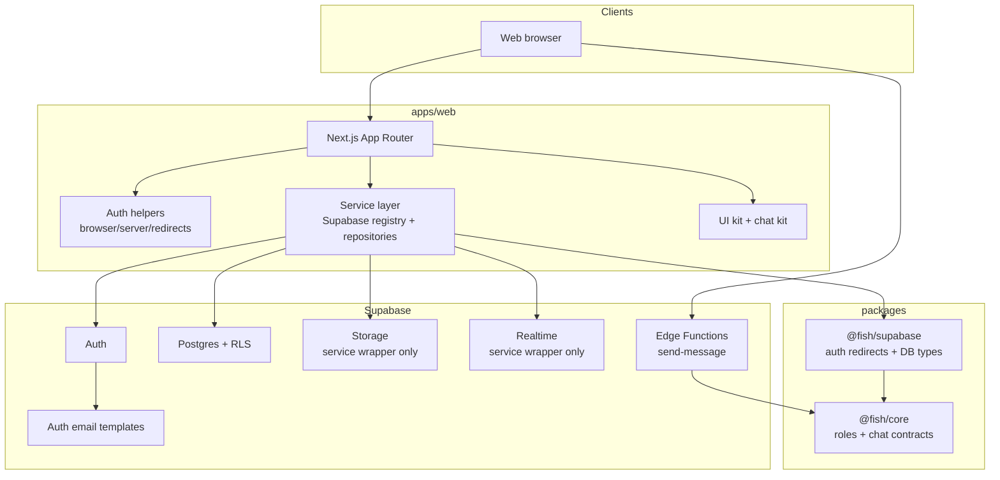
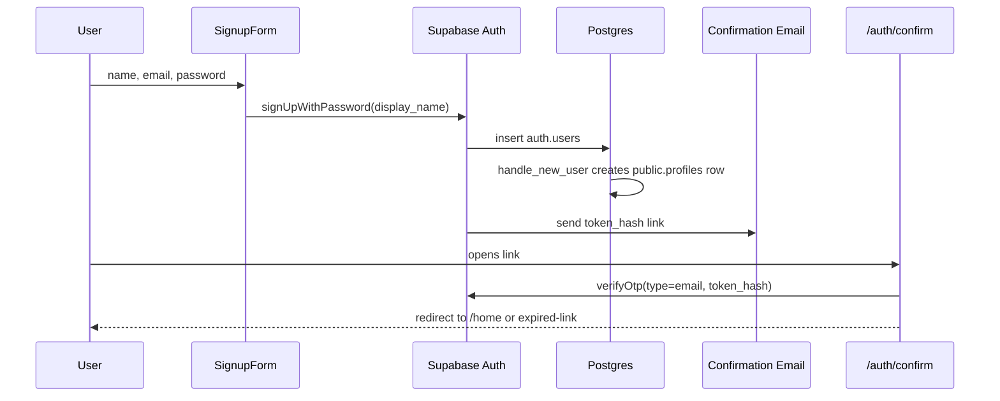
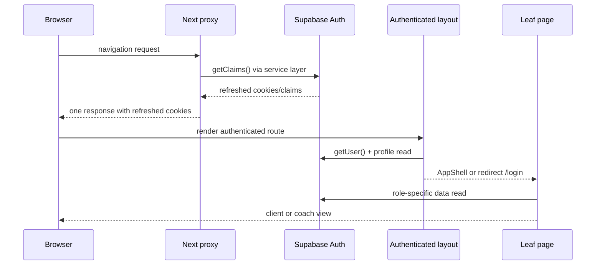
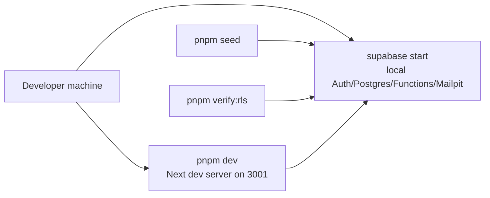
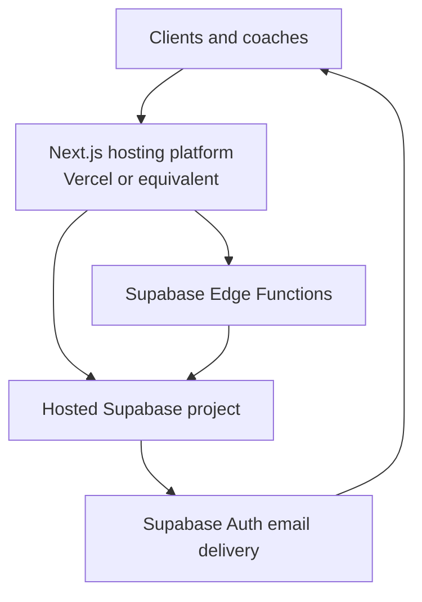

# FISH Architecture

Last verified: 2026-07-06

FISH is a calm English-coaching ChatHub for neurodivergent professionals. The
architecture optimizes for a small set of clear product primitives: coach-led
assignment, role-aware access, one backend of record, and sparse interfaces that
reduce choices instead of adding them.

This document describes the current implementation in this repository. It also
marks planned surfaces clearly so future work does not treat contracts or
prototypes as production behavior.

## Current State

FISH is currently a foundation-stage monorepo:

- Web auth, role-aware routing, client/coach home pages, a shared UI kit, and a
  real persisted 1-on-1 chat route are implemented in `apps/web`.
- Supabase migrations implement auth profiles, coach-client assignments, RLS
  helpers, role guards, email-backed profile reads, and chat tables/RPCs.
- Shared TypeScript contracts live in `packages/core` and `packages/supabase`.
- AI coaching, production CI/CD, and production hosting setup are not
  implemented yet. The unvalidated learning-flow implementations were removed
  from the active product on 2026-07-06.

## System Context



## Technology Stack

| Area | Current technology | Notes |
| --- | --- | --- |
| Monorepo | pnpm workspaces | Workspaces are `apps/*` and `packages/*`; lockfile is `pnpm-lock.yaml`. |
| Web | Next.js 16 App Router, React 19, TypeScript 5.7 | `apps/web` is the primary product surface. |
| Web styling | Tailwind CSS v4 + `@tailwindcss/postcss` | CSS-first config in `apps/web/app/globals.css`; there is no `tailwind.config.js`. |
| Web UI | Base components, Tabler icons, Storybook | UI primitives are under `apps/web/components/ui`; chat components are under `apps/web/components/chat`. |
| Web tests | Vitest, React Testing Library, jsdom | Route/component/service-boundary/token tests live under `apps/web`. |
| Backend | Supabase Auth, Postgres, RLS, Edge Functions, Storage, Realtime | Supabase is the only backend service by default. |
| Shared contracts | TypeScript packages | `@fish/core` contains product types; `@fish/supabase` contains Supabase-specific contracts. |

## Repository Modules

| Path | Responsibility |
| --- | --- |
| `apps/web/app` | Next.js routes, layouts, route handlers, global CSS tokens. |
| `apps/web/components/ui` | Reusable web primitives: `Button`, `Input`, `Card`, `Progress`, `Alert`. |
| `apps/web/components/chat` | Presentational chat components and view-model types; not connected to real DB tables yet. |
| `apps/web/components/shell` | Authenticated app shell. |
| `apps/web/lib/auth` | Browser/server auth helpers and redirect decisions. |
| `apps/web/lib/services` | Runtime-neutral service result/error types, env validation, DI container, and Supabase service registry. |
| `apps/web/lib/supabase` | Compatibility adapters that delegate to the newer service-layer factories. |
| `packages/core` | Supabase-free domain contracts: roles, chat DTOs, `SendMessageCommand`, and limits. |
| `packages/supabase` | Shared Supabase auth redirects and generated database types. |
| `supabase/migrations` | Database schema, triggers, grants, RLS policies, and private helper functions. |
| `supabase/functions/send-message` | JWT-protected Edge Function stub that validates message input but does not persist messages. |
| `supabase/templates` | Confirmation and recovery email templates that route through `/auth/confirm`. |
| `scripts` | Local development seed and RLS verification scripts. |
| `docs` | Project documentation and implementation notes. |

## Runtime Architecture

### Web App

The web app uses the Next.js App Router.

- `apps/web/app/layout.tsx` loads Lexend and Fraunces through `next/font/google`
  and applies global styles.
- `apps/web/app/page.tsx` is a pure server-side redirect. It sends signed-out
  users to `/login`, clients to `/home`, and coaches to `/coach`.
- `apps/web/app/(authenticated)/layout.tsx` is the default-deny boundary for
  authenticated pages. It loads the verified current user/profile and renders
  `AppShell`.
- `/home` is the client home. It reads the current profile, assignment, and
  assigned coach display name.
- `/coach` is the coach home. It reads assigned clients through the
  `coach_clients` relationship.
- `/login`, `/signup`, `/forgot-password`, `/reset-password`, `/check-inbox`,
  `/expired-link`, `/kit`, and `/kit/chat` live outside the authenticated route
  group.
- `apps/web/proxy.ts` refreshes the Supabase session on navigations. Route
  protection intentionally does not live in the proxy.

The codebase separates Supabase clients by runtime:

- `apps/web/lib/services/supabase/browser.ts` creates browser clients and
  browser service registries.
- `apps/web/lib/services/supabase/server.ts` creates Server Component, Server
  Action, and Route Handler clients from Next cookies.
- `apps/web/lib/services/supabase/proxy.ts` owns the fragile cookie refresh
  sequence required by `@supabase/ssr`.

UI-facing code should depend on `apps/web/lib/auth` and `apps/web/lib/services`,
not construct raw Supabase clients directly.

### Service Layer

The service layer wraps Supabase in narrow interfaces:

- `SupabaseAuthService` handles current user reads, session claim refresh,
  password sign-in/sign-up, signup email resend, password reset, password
  update, and sign-out.
- `ProfileRepository` reads profiles and display names.
- `CoachClientRepository` reads the current client assignment and a coach's
  assigned clients.
- `SupabaseStorageService` and `SupabaseRealtimeService` expose typed wrappers
  for future storage/realtime use.
- All services return `ServiceResult<T>` with a shared `ServiceError` shape.

`apps/web/tests/service-boundary.test.ts` enforces that `.tsx` files do not
import `@supabase/*`, `@fish/supabase`, or `@/lib/supabase` directly.

### Shared Packages

`@fish/core` is deliberately backend-free. It defines:

- `UserRole` and `isUserRole()`
- `ChatParticipant`, `ChatConversation`, `ChatMessage`
- `SendMessageCommand`, `SendMessageResult`
- `chatLimits.messageBodyMaxLength = 4000`

`@fish/supabase` depends on `@fish/core` and defines:

- `FishAuthClaims`
- `authRedirects`
- generated `Database` types from migrated tables
- `LegacyChatContracts`, explicitly marked as not-yet-migrated chat contracts

The one-way dependency is:

```text
apps/* -> packages/supabase -> packages/core
apps/* -> packages/core
supabase/functions -> packages/core
```

`packages/core` must not import web or Supabase implementation code.

### Supabase Backend

Supabase is the backend of record:

- Auth owns users and email/password sessions.
- Postgres stores application data.
- RLS is the authorization boundary for simple reads.
- Edge Functions are reserved for command-style writes and sensitive logic.
- Storage and Realtime are part of the architecture, but only service wrappers
  exist in the current web code.

Current Edge Function status:

- `send-message` requires JWT verification in `supabase/config.toml`.
- It accepts only `POST`.
- It trims and validates `conversationId` and `body`.
- It enforces the shared 4000 character body limit.
- It returns `{ accepted: true, conversationId, clientRequestId }`.
- It does not authorize conversation membership or insert rows because
  conversation/message tables do not exist yet.

## Data Model

### Implemented Tables

`profiles`

| Column | Purpose |
| --- | --- |
| `id` | Primary key and foreign key to `auth.users.id`. |
| `role` | `client` or `coach`; defaults to `client`. |
| `display_name` | User display name copied from signup metadata. |
| `email` | Email copied from `auth.users` for coach/client lists. |
| `created_at` / `updated_at` | Timestamps. |

`coach_clients`

| Column | Purpose |
| --- | --- |
| `coach_id` | Coach profile id. |
| `client_id` | Client profile id; unique so each client has at most one coach. |
| `assigned_at` | Assignment timestamp. |

### Database Invariants

- Signup creates a profile through `public.handle_new_user()`.
- Signup always creates `role = 'client'`; role is not trusted from user
  metadata.
- `prevent_role_self_escalation()` rejects authenticated role changes.
- Service-role callers can promote local seed users and assign clients.
- `enforce_coach_client_roles()` prevents malformed coach-client rows.
- Clients can read their own profile, their own assignment, and their assigned
  coach profile.
- Coaches can read their own assignments and assigned client profiles.
- Private `security definer` helpers avoid recursive RLS policy reads.

### Planned Contracts That Are Not Tables Yet

`packages/core/src/chat.ts` defines chat contracts and
`packages/supabase/src/database.types.ts` exposes `LegacyChatContracts`, but
there are no migrated `conversations` or `messages` tables in the generated
`Database` type. Any architecture or feature work that needs real chat must add
migrations, RLS policies, generated types, service methods, and Edge Function
authorization before wiring the UI.

## Key Data Flows

### Signup And Email Verification



Important details:

- The app uses token-hash email links, not fragment-based implicit links.
- `/auth/confirm` validates `next` as a same-origin relative path.
- Expired or consumed links redirect to `/expired-link` with a calm resend flow.

### Session Refresh And Route Protection



Important details:

- Server-side code uses `getUser()` or `getClaims()`, not `getSession()`.
- The proxy refreshes sessions only; authenticated route protection lives in
  the route group layout and leaf pages.
- Wrong-door redirects are owned by leaf pages (`/home` redirects coaches to
  `/coach`; `/coach` redirects clients to `/home`).

### Client Home

```text
ClientHomePage
  -> getClientHomeData()
    -> auth.getCurrentUser()
    -> profiles.findById(user.id)
    -> coachClients.findAssignmentForClient(user.id)
    -> profiles.findDisplayNameById(assignment.coach_id)
  -> render assigned-coach empty state
```

RLS allows the client to read exactly the profile/assignment rows needed for
this screen.

### Coach Home

```text
CoachHomePage
  -> getCoachHomeData()
    -> auth.getCurrentUser()
    -> profiles.findById(user.id)
    -> coachClients.listAssignedClients()
  -> render ClientList or empty state
```

The coach client list joins `coach_clients` to `profiles:client_id(...)` and
relies on RLS to scope rows to the signed-in coach.

### Password Reset

```text
ForgotPasswordPage
  -> auth.resetPasswordForEmail(email)
  -> recovery email links to /auth/confirm?type=recovery&next=/reset-password
  -> /auth/confirm verifies token_hash
  -> ResetPasswordPage calls auth.updateUser({ password })
  -> redirect to /home
```

The reset request page intentionally gives the same success copy whether or not
the address has an account.

### Local Seed And RLS Verification

```text
pnpm seed
  -> service-role Supabase client
  -> auth.admin.createUser() for one coach and three clients
  -> promote coach profile
  -> upsert coach_clients assignments

pnpm verify:rls
  -> signs in with publishable key as seeded users
  -> asserts client and coach visibility boundaries
  -> asserts role self-escalation fails
  -> asserts clients can read assigned coach display name
```

The verification script uses user sessions, not service-role reads, so RLS is
actually exercised.

## UI Architecture

The UI system is intentionally sparse. The product rule is that FISH removes
choices for clients.

Core constraints:

- At most one `Button variant="primary"` per screen.
- Clients receive assigned work; they do not browse menus of plans/templates.
- Controls use a 56px minimum target height.
- Progress is visual, not a grade.
- Copy is sentence-case, direct, and non-scolding.
- Errors and notices guide the user calmly.

Web tokens live in `apps/web/app/globals.css` under `@theme`:

- Colors use native `light-dark()` pairs.
- Structural tokens are monochrome; calm semantic feedback tones are the
  deliberate low-chroma exceptions.
- Typography uses Lexend for body/UI and Fraunces for headings.
- Radius and size tokens include `rounded-card`, `rounded-control`, and
  `--size-control`.
- Global focus and reduced-motion rules are defined in CSS.

The web component layer uses:

- `class-variance-authority` for component variants.
- `cn()` for `clsx` + `tailwind-merge` composition.
- `forwardRef` for focusable primitives.
- Tabler icons only, enforced by `apps/web/tests/icon-source.test.ts`.

## Module Interaction Rules

### Reads

Simple authorized reads should use the Supabase client through the service
layer and rely on RLS:

```text
Route/page/helper -> createServerSupabaseServices()
                  -> repository method
                  -> Supabase table read
                  -> RLS scopes rows
```

### Writes

Command-style writes and sensitive logic should use Edge Functions or other
server-only command handlers:

```text
UI -> service/action -> Edge Function -> explicit authorization -> DB write
```

Examples that belong behind command authorization:

- Sending messages.
- Assigning clients.
- Moderation decisions.
- Future AI-assisted coaching writes.
- Admin operations that require service-role privileges.

### Package Boundaries

- `packages/core` contains product contracts only.
- `packages/supabase` contains generated Supabase contracts and auth redirects.
- Web routes/components should not import raw Supabase clients directly.
- Native clients should mirror contracts or consume generated platform-native
  equivalents later, rather than depending on web implementation modules.

## Deployment Architecture

### Local Development



Common commands:

```bash
pnpm install
pnpm dev
pnpm build
pnpm lint
pnpm typecheck
pnpm supabase:start
pnpm db:reset
pnpm seed
pnpm verify:rls
```

The web dev script currently runs Next on port `3001`.

Required public web environment variables:

- `NEXT_PUBLIC_SUPABASE_URL`
- `NEXT_PUBLIC_SUPABASE_PUBLISHABLE_KEY`

Local admin scripts also require:

- `SUPABASE_SERVICE_ROLE_KEY`

The service-role key must never be exposed to the browser.

### Production Target

No production deploy platform config is checked in. The intended architecture is:



Production setup requires:

- A hosted Supabase project linked with `supabase link`.
- `supabase db push` or equivalent migration deployment.
- Hosted Auth Site URL and redirect allow-list configured for the deployed
  origin.
- Confirmation and recovery templates copied/uploaded to the hosted project.
- `NEXT_PUBLIC_SUPABASE_URL` and `NEXT_PUBLIC_SUPABASE_PUBLISHABLE_KEY` set in
  the web host.
- `SUPABASE_SERVICE_ROLE_KEY` set only in server-side/administrative
  environments.
- Edge Function deployment through the Supabase CLI.
- A staging/prod RLS verification pass using real user sessions.

The existing `docs/deploy-checklist.md` is the operational checklist for hosted
Supabase setup, but it should be kept current as migrations and auth flows
change.

## Design Decisions

### Supabase Is The Backend Of Record

FISH uses Supabase for auth, database, RLS, storage, realtime, and Edge
Functions. There is no Express/Node API service by default. Add another API
only if the product proves it needs one.

### RLS For Reads, Edge Functions For Commands

Simple reads are direct Supabase reads protected by RLS. Writes that change
relationships, send messages, moderate content, or call AI services should go
through command handlers with explicit authorization checks.

### Roles Live In `profiles`, Not User Metadata

Signup metadata is not trusted for authorization. The database trigger creates
every signup as a client, and a role guard prevents authenticated self-promotion.
Service-role promotion is reserved for admin/seed flows.

### Server Auth Must Be Verified

Server-side code uses Supabase `getUser()` or `getClaims()` rather than
`getSession()`, because `getSession()` trusts cookie contents.

### Service Boundary Protects UI Code

UI surfaces consume auth helpers and repository-style services rather than raw
Supabase clients. This keeps runtime-specific cookie/client details at the edge
and gives tests a single abstraction boundary to enforce.

### Chat UI Is Ahead Of Chat Persistence

The chat kit is useful for design and component validation, but it is not
evidence of a complete chat product. The persistence model, RLS, realtime,
message command authorization, retries, and attachments still need to be built.

### Tailwind v4 Is CSS-First

All web design tokens live in `apps/web/app/globals.css`. Do not add
`tailwind.config.js`. Keep `tailwindcss` and `@tailwindcss/postcss` on the same
major/minor version family.

## Testing And Verification

Primary verification commands:

```bash
pnpm typecheck
pnpm lint
pnpm --filter @fish/web test -- --run
pnpm build
pnpm verify:rls
```

Current web test coverage includes:

- Auth page and route behavior.
- Auth redirect helpers.
- Supabase service factory behavior.
- Service boundary enforcement for TSX files.
- UI primitives and chat components.
- Contrast, focus-ring, and icon-source guards.

Current RLS verification covers:

- Client sees only own profile plus assigned coach row.
- Coach sees own row plus assigned clients.
- Client role self-escalation is rejected.
- Client can read assigned coach display name.

## Known Gaps

The following are intentional gaps or incomplete architecture areas:

- No realtime chat subscriptions are wired to product screens.
- No storage buckets or attachment authorization model are defined.
- No active learning-flow engine exists; future learning mechanics require a fresh coach-validation decision before implementation.
- No AI provider, prompt, memory, evaluation, or safety architecture exists yet.
- No checked-in CI/CD pipeline or production web host config exists.
- No production observability, privacy export/delete workflow, or incident
  runbook exists yet.

## Future Work Guidelines

When adding new product capability:

1. Validate learning techniques manually with a coach before encoding them.
2. Add shared domain contracts in `packages/core` only when more than one
   runtime or boundary needs the shape.
3. Add Supabase migrations and regenerate database types before treating data
   as live.
4. Protect reads with RLS and verify them with user sessions, not service-role
   reads.
5. Put command writes behind Edge Functions or server-only command handlers.
6. Use existing UI primitives and preserve the one-primary-action rule.
7. Update this document when module boundaries, data flows, or deployment
   assumptions change.
