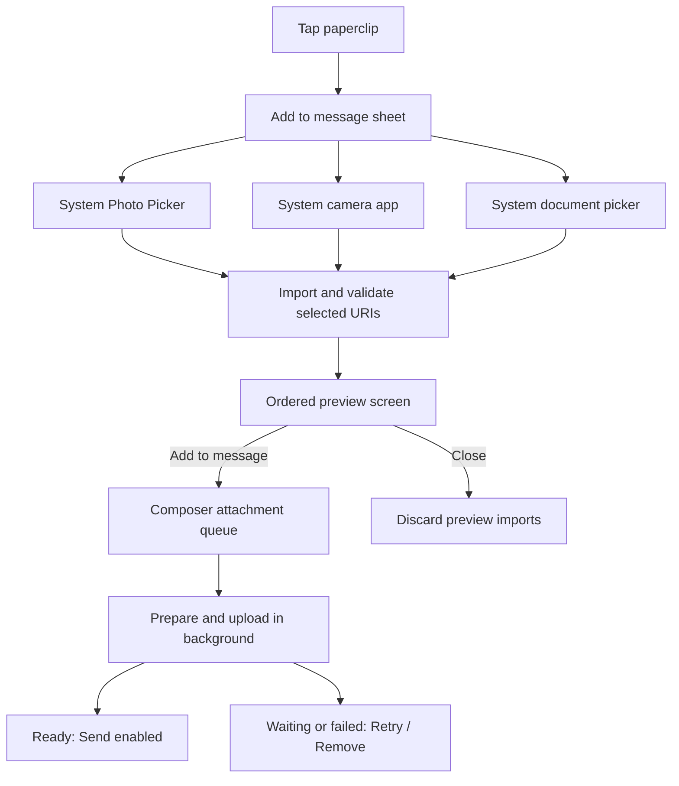

# Android chat attachments: web audit and implementation plan

> **Status:** Proposed for review. No implementation is authorized by this document.
> **Prepared:** 2026-07-17
> **Scope:** Photos and the file types already supported by FISH chat. Video, audio
> recording, polls, image editing, and arbitrary file types are out of scope.

## Executive recommendation

Keep the existing backend's strongest invariants: at most five ordered
attachments, private storage, server-side verification, a ready-before-send
transaction, short-lived delivery URLs, and idempotent message sends. Do not
port the browser's in-memory upload hook to Android.

On Android, use the system Photo Picker, `TakePicture`, and the Storage Access
Framework; immediately import each selected URI into app-private storage; stage
the draft and its order in Room; and let a constrained WorkManager queue prepare,
upload, verify, cancel, and recover each item. The user still presses **Send**
explicitly. Reconnecting may resume attachment uploads, but it must not silently
send a message.

The first delivery slice should be **read parity**: Android must stop hiding
attachment-only messages sent from web and render existing photos/files before it
can create new ones. Sending should then land behind the same feature flag in
picker, queue, and backend code.

The plan deliberately does not add a gallery browser, media-quality chooser,
filters, markup, captions per photo, background-send notification, or reordering
control. These are extra choices that do not serve the initial coaching use case.

## Evidence reviewed

The web audit covered the shared chat contracts, composer and upload hook,
client-side image preparation, Supabase adapters, message renderer, storage
migrations, and both upload/send Edge Functions. The most relevant source entry
points are:

- [`packages/core/src/chat.ts`](../packages/core/src/chat.ts)
- [`apps/web/features/chat/hooks/use-chat-image-uploads.ts`](../apps/web/features/chat/hooks/use-chat-image-uploads.ts)
- [`apps/web/features/chat/hooks/prepare-chat-image.ts`](../apps/web/features/chat/hooks/prepare-chat-image.ts)
- [`apps/web/features/chat/components/composer/add-menu/add-menu.tsx`](../apps/web/features/chat/components/composer/add-menu/add-menu.tsx)
- [`apps/web/features/chat/components/composer/image-upload-preview/image-upload-preview.tsx`](../apps/web/features/chat/components/composer/image-upload-preview/image-upload-preview.tsx)
- [`apps/web/features/chat/components/message-images/message-images.tsx`](../apps/web/features/chat/components/message-images/message-images.tsx)
- [`apps/web/lib/services/supabase/chat-message-hydration.ts`](../apps/web/lib/services/supabase/chat-message-hydration.ts)
- [`supabase/functions/chat-image-command/index.ts`](../supabase/functions/chat-image-command/index.ts)
- [`supabase/functions/send-message/index.ts`](../supabase/functions/send-message/index.ts)
- [`supabase/migrations/0017_chat_images.sql`](../supabase/migrations/0017_chat_images.sql)
- [`supabase/migrations/0018_chat_file_attachments.sql`](../supabase/migrations/0018_chat_file_attachments.sql)

The Android fit assessment covered `:app`, `:feature:chat`, `:data:chat`,
`:core:designsystem`, Room, the Supabase remote adapter, current message mapping,
runtime permissions, test infrastructure, and dependency versions. The current
app is Kotlin/Compose, min SDK 26, target SDK 36, uses Room, Coil 3, Ktor, and
Supabase Kotlin 3.6.0, and does not yet include WorkManager or the Supabase
Storage module.

The Android recommendations use official Android and Supabase documentation,
linked beside the decisions they support. Messaging-app comparisons use public
product/support material and describe patterns, not contracts that FISH should
copy.

---

## 1. Current web behavior and reusable backend contracts

### 1.1 Adding photos and files

The composer exposes a quiet add menu backed by a hidden `<input type="file"
multiple>`. The same handler accepts drag-and-drop. The current browser accept
list is:

| Kind | Accepted source types |
|---|---|
| Photos | JPEG, PNG, WebP |
| Documents | PDF, plain text, CSV, DOCX, XLSX, PPTX |

When the browser omits a document MIME type, the client infers it from the six
supported document extensions. It does not infer image MIME types from file
extensions. GIFs and stickers are separate message media and cannot be combined
with uploaded attachments; text may accompany attachments.

The shared limits are five attachments per message, 10 MiB per source file, and
5 MiB for the prepared image upload. A selected image is decoded and normalized
in the browser to WebP, with a longest edge of 2560 px, a target of 2 MiB, quality
0.8, and EXIF not preserved. Preparation prefers a worker and falls back to the
main thread after a 45-second timeout.

Validation is batch-atomic. If adding the batch would exceed five, or any item is
empty, unsupported, or over 10 MiB, nothing from that picker/drop result is
added.

### 1.2 Single and multiple selection

The hook appends `File[]` in callback order. Previews and final
`attachmentIds` preserve that order. A single photo and a multi-photo selection
use the same composer strip; there is no dedicated preview screen, no order
indicator, and no reorder control. A user can remove any item. Identical bytes or
the same source file can be added more than once.

Uploads run in pairs: items 1-2 start together, then 3-4, then 5. This bounds
network/CPU use and preserves visual order, but a slow item blocks the next pair.
Server-side completion is serialized even when network transfers overlap.

### 1.3 Progress, cancellation, retry, and failure

Each in-memory pending item has a client upload ID, optional server attachment
ID, source `File`, kind, source MIME, blob preview URL, progress, status, paths,
dimensions, and stored metadata. The visible state sequence is:

`preparing -> uploading -> processing -> ready | failed`

Progress is synthetic across stages: preparation occupies roughly 0-25%, bytes
25-90%, and server completion 92-100%. The primary transfer uses signed TUS with
6 MiB chunks and retry delays of 0, 1, 3, and 5 seconds. It falls back to a signed
PUT only for TUS 400/403 responses.

Remove aborts an active transfer, revokes the blob URL, removes the preview, and
best-effort cancels the server attachment. Retry creates a new client upload ID
and upload session in the same visual slot. The old failed server row is left for
expiry. Send is disabled until every remaining attachment is ready. A failed
item offers **Try again** and remove; the app does not silently send a successful
subset.

The browser warns before leaving only during `uploading` or `processing`, not
during preparation. Component unmount aborts work. There is no durable queue,
offline staging, process recovery, or recovery after reload. TUS can resume an
interrupted browser transfer only while its fingerprint/session remains useful;
the UI state itself is not persisted.

After **Send**, optimistic message data owns the blob preview URLs. A failed
message row can be retried with the same message `clientRequestId` and attachment
IDs, which prevents a duplicate message. Attachments are not restored into the
composer.

### 1.4 Upload API and server validation

`chat-image-command` is now a generalized attachment command despite its image
name. Its operations are initialize, complete, cancel, and refresh URLs.

Initialize checks authenticated conversation membership, request shape, exact
MIME allowlist, 1-10 MiB declared source size, original-name length, and rate
limits (20 initializations per 10 minutes and 100 per day). It is idempotent for
the same user/client upload ID and matching metadata. It creates an unbound
`message_attachments` row and returns a private staging path, signed upload token,
TUS endpoint, and signed-PUT fallback.

Complete claims the row for processing and validates the stored object again:

- Images must be WebP by magic bytes and pass ImageMagick decoding. The server
  auto-orients, rejects dimensions over 4096 or 25 million pixels, strips
  metadata, writes a display variant capped at 1920 px/1.25 MiB, and writes a
  64 px thumbnail capped at 16 KiB.
- PDFs require a PDF header; text/CSV must be UTF-8 and contain no NUL; OOXML
  must be a ZIP with `[Content_Types].xml`, the expected Word/Excel/PowerPoint
  directory, and no VBA payload.
- Ready files remain private source documents and have no thumbnail or image
  dimensions.

`send-message` accepts ordered attachment IDs. The database transaction locks
them, verifies that all are ready, unexpired, unbound, uploaded by the sender,
and belong to the conversation, then binds them to the new message and records
their request order as `position`. The same transaction and stable
`clientRequestId` provide message idempotency. Duplicate IDs in a request are
currently collapsed by the Edge Function before the five-item check; duplicate
content is not detected.

### 1.5 Storage and message representation

The private `chat-images` bucket currently permits WebP plus the six document
MIME types and caps stored objects at 10 MiB. Delivery uses signed URLs with a
15-minute lifetime.

`message_attachments` stores:

- attachment, conversation, optional message, and uploader IDs;
- `image | file`, status, unique uploader/client upload ID, and position 0-4;
- staging, display, and optional thumbnail paths;
- original name, source/stored MIME and byte sizes;
- image dimensions, failure code, expiry, and timestamps.

RLS lets an uploader read their own unbound rows and conversation members read
only ready attachments bound to a non-deleted message. The backend has an
`expire_unattached_chat_images()` function, but the audit found no scheduler
that invokes it or deletes expired staging objects.

The shared TypeScript message contract calls the heterogeneous collection
`images?: ChatImage[]`; `kind: "file"` distinguishes documents. This name is
backward-compatible but misleading.

### 1.6 Rendering in web messages

Hydration queries ready attachment rows by message and position, then batch
signs display/thumbnail paths. Realtime messages initially contain no
attachments and are subsequently hydrated.

The message renderer separates the ordered collection into all photos followed
by all files. Consequently, a source order of photo/file/photo renders as
photo/photo/file. A single photo has a responsive, aspect-ratio-clamped frame;
2-5 photos use wrapping tiles rather than a fixed collage. Photos progressively
cross-fade from a 64 px thumbnail to the display variant and open in a full-screen
dialog. Missing/expired URLs can be refreshed per attachment.

File cards show the original name, friendly type, size, and an open/download
control. They open a signed URL in a new tab. The renderer has useful lazy image
loading and calm retry states, but no malware/quarantine state, document preview,
or user-authored image description. Photo alt text is generic: “Image shared by
{name}.”

### 1.7 Reusable contracts

The following should be reused on Android rather than replaced:

- conversation membership/RLS and private bucket;
- attachment initialize/complete/cancel/refresh commands;
- ordered, ready-only `message_attachments` rows;
- server image normalization and document signature checks;
- five-item transactional message binding;
- message `clientRequestId` and upload `clientUploadId` idempotency;
- 15-minute signed delivery URLs and stable storage paths;
- calm, stable failure codes mapped to client copy.

No Node/Express service is needed. Android should call the same Supabase Edge
Functions and RLS-protected tables.

---

## 2. Gaps and weaknesses in the current implementation

### Blocking Android interoperability gap

Android already defines `ChatAttachment` and `ChatMessage.images`, but its
remote DTO never loads `message_attachments`, Room has no attachment table or
column, entity mappers drop `images`, and `MessageUiModel` has no attachment
field. More seriously, the remote mapper and ViewModel filter blank messages
unless they contain a GIF, sticker, or deletion marker. A photo-only or
file-only message sent from web can therefore disappear from Android entirely.
This is the first defect the project must close.

### Reliability and state gaps

- Web queue state is memory-only and is lost on reload, process death, or tab
  closure; offline selection/recovery is not supported.
- Retry always creates a new upload identity instead of first attempting to
  resume the recoverable server session.
- There is no persisted byte offset, attempt count, terminal reason, cleanup
  deadline, or ownership cleanup on sign-out.
- Two-at-a-time batches couple unrelated items; one slow transfer delays later
  items. Completion is globally serialized in the composer hook.
- A URL refresh is attachment-oriented and can produce N follow-up calls from a
  rendered group.
- Photo load failures can refresh an expired signed URL, but a file card with an
  already-present URL opens it directly; a 15-minute-expired link can therefore
  land on a storage error instead of refreshing at tap time.

### UX and contract gaps

- One invalid item rejects the whole selection. The error names only the first
  invalid file and loses valid work.
- Mixed photo/file ordering is stored correctly but rendered incorrectly.
- Duplicate bytes are accepted without warning, wasting data and a slot.
- The add menu contains inert audio-recording and poll choices, and the drop
  overlay says “Add images” even though files are supported.
- Several generalized backend/client errors still say “image.”
- The contract/property/bucket/command names make files look like an accidental
  extension of photos.
- HEIC/HEIF, common on modern devices and decodable from Android 8, are not in
  the source allowlist. AVIF support is guaranteed only on Android 14+, so it
  cannot be assumed across FISH's min-SDK range. Android documents these platform
  differences in its [supported media formats](https://developer.android.com/media/platform/supported-formats).

### Security and lifecycle gaps

- Browser MIME/type/size metadata is advisory. The server correctly checks
  stored bytes, but `source_byte_size` is client-declared and cannot prove the
  original photo's real size because only the normalized WebP is uploaded.
- OOXML validation unzips untrusted input in memory without an explicit entry
  count or expanded-byte budget. A compressed document needs bounded expansion
  before it can be treated as safe to inspect.
- Signature and macro checks are not malware scanning. The product needs an
  explicit risk decision before enabling new Android document uploads.
- PDF and Office document metadata are preserved. Image metadata is stripped,
  but filenames can still disclose information.
- The expiry RPC is not scheduled and only marks database rows; abandoned
  staging objects may remain. Storage lifecycle cleanup is a release blocker.

---

## 3. Recommended Android user experience

### 3.1 Experience principles

1. **One clear route into attachments.** Add one quiet paperclip control beside
   the composer. Keep the existing emoji/GIF/sticker control separate. The
   paperclip opens a compact sheet with only **Choose photos**, **Take a photo**,
   and **Choose a file**. These are secondary rows, not competing primary
   buttons; **Send** remains the only primary action in chat.
2. **Use trusted system selection surfaces.** Do not build a FISH gallery. The
   Photo Picker grants access only to chosen media and can include cloud media;
   AndroidX falls back to `ACTION_OPEN_DOCUMENT` on unsupported devices. See the
   official [Photo Picker guide](https://developer.android.com/training/data-storage/shared/photo-picker).
3. **Review before committing.** After a picker/camera result, show one calm,
   full-screen attachment preview. The single primary action is **Add to
   message**. A quiet close returns without changing the draft; remove controls
   operate per item. Do not add filters, crop, quality toggles, or reorder in v1.
4. **Preserve intent.** The order selected is the order previewed, uploaded,
   bound, announced, and rendered. Failed items do not cause a successful subset
   to be sent without confirmation.
5. **Uploads may recover; messages never surprise.** Local preparation and
   upload may continue after leaving chat and resume after connectivity returns.
   The message is sent only after a deliberate **Send** press when all remaining
   attachments are ready.

### 3.2 Selection and preview flow



For photos, launch `PickMultipleVisualMedia` with the number of remaining slots.
The app's current Activity 1.13 dependency supports
`PickVisualMediaRequest(..., isOrderedSelection = true)`, added in Activity
1.10. The [official request API](https://developer.android.com/reference/androidx/activity/result/PickVisualMediaRequestKt)
lets the picker expose ordered selection. Preserve the returned URI list order
and write ordinals immediately. On the fallback picker, AndroidX may ignore the
requested maximum, so cap to the first available slots after return and explain
that the remainder were not added. Never infer order from filenames, timestamps,
or MediaStore queries.

The preview uses the first selected photo as the large current item, a small
ordered rail for 2-5 items, and a file card for documents. TalkBack announces
“Photo 2 of 4” or “File 2 of 4, report.pdf, PDF, 1.2 megabytes.” The visual item
number can be shown subtly for multi-select; it is an order cue, not a score.

Validation is item-specific:

- Valid items remain available.
- Unsupported, empty, unreadable, over-limit, corrupt, and duplicate items are
  excluded with one calm summary such as “3 files were added. 1 file was too
  large.”
- If selection exceeds remaining slots, keep the first items in picker order and
  say how many were not added.
- If nothing is valid, return to the source sheet with a specific next step.

Within the current draft, use SHA-256 of the staged/normalized content to detect
exact duplicates. Keep the first item and say “That file is already added.” Do
not deduplicate against chat history: intentionally sending the same file later
is valid, and cross-message content hashes create unnecessary privacy coupling.

### 3.3 Camera

Use `ActivityResultContracts.TakePicture`, which writes a full-size image to a
provided content URI, rather than returning a thumbnail bitmap. The output is an
app-private temporary file exposed only through a narrowly configured
`FileProvider`. Android documents both the
[`TakePicture` contract](https://developer.android.com/reference/androidx/activity/result/contract/ActivityResultContracts.TakePicture)
and [secure content-URI file sharing](https://developer.android.com/training/secure-file-sharing).

The manifest should mark camera hardware optional and hide **Take a photo** when
no handler/camera exists. FISH already declares `CAMERA` for calls. Android warns
that a target-M+ app which declares but has not been granted that permission can
receive a `SecurityException` from `ACTION_IMAGE_CAPTURE`; therefore reuse the
app-owned, just-in-time camera-permission coordinator before launch. See the
[`ACTION_IMAGE_CAPTURE` contract](https://developer.android.com/reference/android/provider/MediaStore#ACTION_IMAGE_CAPTURE).

Cancel deletes the empty temporary file. A successful camera photo is not added
to the public gallery; it is only a message draft unless a future, separately
validated “save” feature is added.

### 3.4 Document selection

Use `ActivityResultContracts.OpenMultipleDocuments`/`ACTION_OPEN_DOCUMENT` with
the exact six document MIME types. Do not use `*/*`, and do not request broad
storage/media permissions. The user-selected grant is sufficient for the
document; Android's [Storage Access Framework](https://developer.android.com/training/data-storage/shared/documents-files)
also works with local and cloud document providers.

The file name, reported size, and reported MIME from `ContentResolver` are hints,
not authority. Read through the returned URI, count bytes, inspect format, and
copy into private staging. Never resolve a “real file path.”

### 3.5 Composer queue

After **Add to message**, return to the existing chat composer. Show an ordered
horizontal queue for photos and compact rows for files. Each item has exactly one
status line and a 48 dp remove/retry target:

| State | Visible treatment | User action |
|---|---|---|
| Preparing | Thumbnail skeleton + “Preparing” | Remove |
| Waiting for connection | Paused ring + “Waiting for connection” | Remove |
| Uploading | Determinate ring/bar when bytes are known | Cancel/remove |
| Checking | “Checking file” | Remove/cancel best effort |
| Ready | Quiet check, no percentage | Remove |
| Failed, recoverable | Notice copy | Try again / Remove |
| Failed, permanent | Reason and next step | Remove; reselect if appropriate |

Keep message text editable throughout. Disable **Send** while any retained item
is not ready and expose the reason through accessible supporting text. If all
items are removed, the ordinary text-only behavior returns.

### 3.6 Permission behavior by Android version

The picker architecture intentionally avoids storage/media permission branches:

| Android version in FISH support | Photos | Documents | Camera |
|---|---|---|---|
| API 26-28 | AndroidX Photo Picker fallback/backport, ultimately a user-selected document URI | SAF `ACTION_OPEN_DOCUMENT`; no broad storage permission | Existing camera app + app-private FileProvider URI; request `CAMERA` first because FISH already declares it for calls |
| API 29-32 | Modular/backported Photo Picker when available, automatic AndroidX fallback otherwise | Same SAF contract | Same just-in-time camera permission and private output |
| API 33-36 | Native/system Photo Picker; do not request `READ_MEDIA_IMAGES` | Same SAF contract | Same just-in-time camera permission and private output |

Do not add `READ_EXTERNAL_STORAGE`, `WRITE_EXTERNAL_STORAGE`,
`READ_MEDIA_IMAGES`, selected-photos access, or `MANAGE_EXTERNAL_STORAGE` for
this feature. Android describes Photo Picker as selected-media access without
whole-library permission and recommends it over MediaStore permission for this
case in the [shared-media guide](https://developer.android.com/training/data-storage/shared/media#photo-picker).

### 3.7 Message rendering

Render the authoritative attachment list in `position` order. Convert consecutive
photo runs into a cohesive collage while leaving intervening file cards in their
actual positions:

- one photo: aspect-preserving frame clamped to a practical portrait/landscape
  range;
- two: equal pair;
- three: first selected photo large, next two stacked;
- four: 2x2;
- five: first selected photo large plus a balanced four-item remainder.

This makes selection order meaningful without adding a reorder UI. Tap a photo
for a full-screen viewer with close and zoom; no editing or sharing controls in
v1. Use the server thumbnail in the list and the display variant in the viewer.

File cards show sanitized filename, type, and size. Tapping downloads through a
fresh authenticated/signed URL to app-private cache, verifies the expected size
and type again, and opens it through `FileProvider` with a temporary read grant
and the exact MIME type. Do not render documents in a WebView and do not execute
content. Provide a chooser only when multiple safe viewers exist; a missing
viewer gets calm copy.

### 3.8 Messaging-app reference patterns

These comparisons are directional, based on publicly documented/observable
behavior as of July 2026:

| Product pattern | Useful signal | FISH decision |
|---|---|---|
| Signal uses one attachment entry point for photo, video, or file, followed by an explicit send. It exposes sending/sent/delivered/read states and documents that a large attachment can leave a message spinning or paused until removed. Its support material also separates shared Media, Files, Audio, and All in history. [Send a message](https://support.signal.org/hc/en-us/articles/360007060212-Send-a-message), [sending states](https://support.signal.org/hc/en-us/articles/360009303072-Troubleshooting-sending-messages), [view files](https://support.signal.org/hc/en-us/articles/360007317471-View-and-save-media-or-files) | A single familiar entry point, visible pending state, and distinct media/file presentation reduce ambiguity. | Use one paperclip and visible state, but only three source rows; give each failed item retry/remove so one attachment does not leave the whole message mysteriously paused. Do not copy Signal's larger media scope. |
| Google Messages combines gallery and capture, retains an explicit Send, and offers optimized versus original quality. Captured photos are not automatically saved. [Google Messages media help](https://support.google.com/messages/answer/6159880) | Preview-before-send and private capture are good defaults; quality choice is useful in a general messenger. | Keep private capture and explicit send. Do **not** add a quality toggle; FISH automatically applies its reviewed chat-quality budget. |
| Telegram's public API treats grouped media as an ordered group and can upload media before the send operation. [Telegram file API](https://core.telegram.org/api/files) | Upload and message binding are separate lifecycle stages; ordered groups have one message identity. | This matches FISH's existing ready-then-transactional-bind contract. Use one message and preserve order, but retain FISH's five-item limit. |
| Messenger documents selecting multiple photos before Send, optional HD, and separate file selection. [Messenger HD photos and files](https://about.fb.com/news/2024/04/hd-photos-shared-albums-and-more-on-messenger/) | Multi-select preview and recognizable file cards are established patterns. | Use multi-select preview and grouped rendering. Skip HD toggles, albums, and 100 MB files because they add choices and scope. |
| Gmail's Android attachment flow exposes Photos, Camera, and Files, allows up to five photos per selection, continues attachment work in the background, and explains upload failures. [Gmail attachment help](https://support.google.com/mail/answer/6584?co=GENIE.Platform%3DAndroid&hl=en-EN) | The three-source model and durable draft attachment state are familiar on Android. | Use the same three source concepts, but keep chat's explicit ready-before-send rule and per-item retry/removal. |

FISH should copy the stable mental models—system selection, ordered preview,
visible pending state, explicit send, grouped display—not product-specific
complexity such as albums, filters, original-quality toggles, arbitrary types,
or giant limits.

---

## 4. Proposed Android architecture

### 4.1 Module ownership

Do not add a new Gradle module initially. Existing boundaries are sufficient:

| Module | Ownership |
|---|---|
| `:app` | Activity-result launchers, camera runtime permission, FileProvider, Photo Picker backport manifest entry, WorkManager configuration/worker factory, sign-out cleanup wiring |
| `:feature:chat` | Source sheet, preview screen, queue UI, message attachment UI, `AttachmentUiModel`, intents/events, ViewModel orchestration; no Room, URI, WorkManager, or Supabase imports |
| `:data:chat` | Attachment repository seam, Room entities/DAOs/migrations, URI importer interface and Android implementation, image preparer, queue scheduler/worker, signed-TUS transport, Supabase commands, attachment hydration and URL refresh |
| `:core:designsystem` | Reusable progress/status primitives only if more than chat needs them; otherwise keep attachment visuals feature-owned |
| `:core:supabase` | Install and expose the existing authenticated Supabase client with the Storage plugin; never embed a service-role key |

This follows the app's current convention that `:app` owns platform activity
results and runtime permissions, `:feature:chat` stays provider-free, and
`:data:chat` owns Room/Supabase implementations.

Define a small app-to-feature launcher contract, for example
`AttachmentSourceLauncher`, with results expressed as opaque selection tokens.
Do not leak `android.net.Uri` into feature state or persist it in `SavedStateHandle`.
The data layer converts results to local attachment IDs before the ViewModel
stores them.

### 4.2 Durable local model

Move to a normalized Room schema rather than serializing attachments into the
message row.

`message_attachments` (local read model):

- `id` primary key, message/conversation IDs, position;
- kind, ready status, original/sanitized name, stored MIME/size;
- width/height, thumbnail/display paths;
- no persisted signed URLs;
- foreign key/cascade with the local message where practical.

`pending_attachments` (local draft/upload model):

- stable local ID and stable `client_upload_id`;
- user, conversation, draft-group ID, and position;
- kind, source name/MIME/size, normalized MIME/size/hash;
- private source/staged file names (relative identifiers, never external paths);
- server attachment ID, TUS upload URL/offset/expiry when available;
- state, progress bytes, attempt count, failure code, retry-after time;
- created/updated/cleanup timestamps.

The user ID is part of every draft lookup. Sign-out cancels tagged work and
securely removes that user's staged rows/files. App backup remains disabled, so
these private drafts do not leave the device through Android backup.

Room is the UI authority. WorkManager writes state/progress to Room in bounded
increments; Compose observes the repository flow. Do not use WorkManager's small
`Data` payload as the attachment record. Each worker receives only a stable local
row or queue ID and reloads current auth/session and database state at execution.

### 4.3 Remote read path

For page load and reconnect backfill:

1. Query messages as today.
2. Batch query ready `message_attachments` for all page message IDs, ordered by
   position.
3. Batch-create 15-minute signed URLs for distinct thumbnail/display paths.
4. Map malformed rows to an unavailable attachment placeholder rather than
   hiding the message.
5. Write messages and attachment rows in one Room transaction.
6. Realtime remains a hint: on a message event, fetch that message's attachments
   before completing the Room upsert, or insert the message then hydrate it in a
   bounded follow-up without changing list identity/scroll position.

The ViewModel inclusion rule becomes: body, GIF, sticker, attachment,
unavailable-attachment placeholder, or deletion. Add `attachments` to
`MessageUiModel` and retry logic. This is mandatory before Android can send.

Signed URLs are delivery credentials, not durable model data. Keep stable paths
in Room and fetch URLs on demand/batch. Use a stable Coil memory/disk cache key
such as `attachmentId:thumbnail:contentVersion` so rotating signatures do not
destroy cache reuse. Never log URLs because their query tokens are credentials.

### 4.4 Import and image preparation

For every returned content URI:

1. Open with `ContentResolver`; query display name/size/MIME only as hints.
2. If persistable access is available, take it only long enough to guarantee the
   import. The Photo Picker guide permits `takePersistableUriPermission()` for
   longer-running work but Android caps an app at 5,000 grants, and a moved or
   deleted document can still invalidate a grant. Therefore copy promptly and
   release the grant after a verified private copy. See [Photo Picker URI
   persistence](https://developer.android.com/training/data-storage/shared/photo-picker#persist-media-file-access).
3. Stream into an app-private temporary file while counting actual bytes; abort
   at limit + 1. Use atomic rename only after successful validation. Do not load
   whole documents into memory.
4. For images, inspect dimensions/type before full decode, enforce the decoded
   pixel ceiling, and decode a sampled target on an IO/limited-parallelism
   dispatcher. Android warns that full camera bitmaps can consume tens of
   megabytes and recommends bounds-first, sampled loading in
   [Loading Large Bitmaps Efficiently](https://developer.android.com/topic/performance/graphics/load-bitmap).
5. On API 28+, use `ImageDecoder` with a target size and reject partial/corrupt
   output. On API 26-27, use bounds-first `BitmapFactory` and
   `androidx.exifinterface` to apply all rotation/flip orientations. The
   [ImageDecoder API](https://developer.android.com/reference/android/graphics/ImageDecoder)
   supports URI sources, header inspection, and target sizing; the
   [ExifInterface API](https://developer.android.com/reference/androidx/exifinterface/media/ExifInterface)
   defines rotation and mirrored orientation states.
6. Normalize to WebP with the same 2560 px/5 MiB hard boundary, iteratively
   reducing quality/dimensions as needed. Re-encoding, rather than copying EXIF,
   strips GPS, device, timestamp, and embedded preview metadata. Generate a small
   local preview separately; never retain full bitmaps in ViewModel state.
7. Compute SHA-256 of the exact normalized upload (or exact document) and persist
   it for draft duplicate detection and end-to-end byte verification.

The recommended compatibility improvement is to accept HEIC/HEIF sources on
Android 26+ and normalize them to WebP. AVIF should be accepted only on API 34+
after `ImageDecoder.isMimeTypeSupported()` succeeds. Backend initialize must
allow these declared source MIME types even though the stored upload remains
WebP. Web can adopt them later only when the browser can decode them.

**Proposed size policy requiring approval:** keep documents at 10 MiB; allow an
image source up to 25 MiB so modern camera output can be decoded and reduced;
keep normalized uploads at 5 MiB and decoded input at 25 million pixels. This
requires shared/backend changes. If product/security do not approve the 25 MiB
source allowance, v1 can retain 10 MiB and must test/reject oversize camera
output with calm copy. The normalized upload and pixel limits are the actual
server resource boundaries; declared original size is not a security proof.

### 4.5 Upload queue and WorkManager

Use WorkManager because attachment transfer must survive leaving the screen,
process death, and reboot. Android explicitly recommends it for persistent work
and notes that its schedule survives restarts/reboots; it supports constraints,
unique work, retry/backoff, observation, and cancellation. See
[persistent work](https://developer.android.com/develop/background-work/background-tasks/persistent),
[work requests](https://developer.android.com/develop/background-work/background-tasks/persistent/getting-started/define-work),
and [managing/cancelling work](https://developer.android.com/develop/background-work/background-tasks/persistent/how-to/manage-work).

Use one unique queue worker per signed-in user and conversation/draft group. It
loads pending rows and runs at most two attachment coroutines concurrently; each
item remains independently cancellable through Room state checks and transport
abort. This avoids five unconstrained workers and avoids the web's pair barrier:
when one finishes, the next starts even if its partner is slow.

Constraints:

- `NetworkType.CONNECTED` for initialize/upload/complete;
- no charging or unmetered constraint for <=10 MiB chat files;
- `StorageNotLow` for private import/prepare where available;
- ordinary one-time work, not expedited or a long-running foreground worker.

These uploads should finish well below WorkManager's ordinary execution window.
Android 16 counts long-running WorkManager/foreground work against job quota, so
do not introduce a foreground upload notification for this file size. Revisit
only if future limits make work exceed 10 minutes. See [Android background task
selection](https://developer.android.com/develop/background-work/background-tasks)
and [long-running worker constraints](https://developer.android.com/develop/background-work/background-tasks/persistent/how-to/long-running).

Use exponential WorkManager backoff for transient network, 408, 425, 429, and
5xx failures, honoring server `Retry-After`. Authentication failure first
attempts session refresh; if the user is signed out, pause terminally as
`sign_in_required` and clean up at sign-out. Validation/authorization/not-found
errors are permanent. Cap automatic attempts (recommended: five) and then show
manual **Try again**; a manual retry retains the local row/order and upload ID
unless the server session has expired or become terminal.

Use Supabase TUS as the primary transport. Supabase recommends resumable uploads
for files over 6 MiB, unstable networks, and progress, and its upload URLs remain
valid for up to 24 hours. The Kotlin Storage SDK exposes resumable file uploads,
pause/cancel/state, and disk-backed continuation. See [Supabase resumable
uploads](https://supabase.com/docs/guides/storage/uploads/resumable-uploads) and
the [Kotlin upload API](https://supabase.com/docs/reference/kotlin/storage-from-upload).

There is one required proof before coding the queue: demonstrate that Supabase
Kotlin 3.6.0 can resume the existing Edge-issued **signed** TUS session with the
`x-signature` header while retaining the current no-client-INSERT RLS posture.
If the SDK cannot express that header/session safely, implement a narrow Ktor TUS
adapter behind `AttachmentUploadTransport`; do not weaken storage RLS. A signed
PUT via `uploadToSignedUrl` is an acceptable fallback for normalized files under
6 MiB, but not the release path for 6-10 MiB documents on unstable connections.

### 4.6 State machine

Use one explicit persisted state machine; never infer user-visible state from a
percentage:

```text
selected
  -> importing -> preparing
  -> waiting_for_network -> initializing -> uploading -> verifying -> ready
  -> failed_recoverable -> waiting_for_network / initializing / uploading
  -> failed_permanent
  -> cancelling -> cancelled
```

Transitions are idempotent. On process start, reconcile Room with WorkManager and
the server attachment row:

- ready server row -> local ready;
- active TUS session -> resume from server/SDK offset;
- pending/uploaded/processing server row -> continue or poll/complete once;
- expired/cancelled/failed server row -> create a new server attachment only
  after manual/allowed automatic retry, retaining local draft identity/order;
- local file missing -> permanent `local_copy_unavailable` with remove/reselect;
- message already bound for the same `clientRequestId` -> treat send as success.

Progress stored in Room is bytes sent/total plus stage. Throttle writes to no
more than about 4 per second and on meaningful boundaries. TalkBack receives
stage changes and coarse milestones, not every byte/percent event.

### 4.7 Explicit send and partial failure

The attachment queue is pre-upload, not a silent outgoing-message queue. The
existing app policy remains: drafts are durable offline; sends are not silently
queued.

- If connectivity disappears before **Send**, attachment work becomes “Waiting
  for connection” and resumes later. The text/attachment draft remains.
- **Send** is enabled only when every retained item is ready and the app is
  online. It sends the ordered server attachment IDs with a stable message
  `clientRequestId`.
- If item 2 of 4 fails while 1, 3, and 4 are ready, keep all four slots. Offer
  **Try again** on item 2 or **Remove**. Do not automatically send 1, 3, and 4.
- Removing item 2 compacts local positions to 0,1,2 and preserves relative order;
  final binding uses the compacted order.
- If send fails after attachments are ready, keep the failed optimistic message
  and retry with the same message request ID and same ordered attachment IDs.
- If the backend reports an attachment expired/unavailable during send, return
  that item to recoverable queue state; do not duplicate already-ready objects.

---

## 5. Required API, schema, storage, and backend changes

### Required before Android read parity

No remote schema change is required to read the existing rows. Android must add
its local Room schema/migration, remote DTO, batch hydration, stable URL refresh,
and UI model support. Add contract fixtures proving the same database rows map
to the same order/kind on web and Android.

### Required before Android can upload/send

1. **Generalize public naming without breaking web.** Treat `attachments` as the
   canonical domain term. Keep `images` as a deprecated compatibility alias at
   the web boundary until both clients migrate. Rename new Android types and new
   error copy now; do not create new `ChatImage*` Android APIs.
2. **Add Android source MIME support.** Extend initialize allowlists for
   `image/heic` and `image/heif`, and conditionally `image/avif`. Stored image
   MIME remains `image/webp`. If approved, split source limits into 25 MiB images
   and 10 MiB files; keep actual stored image upload <=5 MiB.
3. **Add integrity metadata.** Accept optional normalized/source upload SHA-256
   on initialize, store it, compute the hash of the staged object on complete,
   and fail on mismatch. It is an integrity check, not an authorization decision
   or history-wide dedupe key.
4. **Normalize names server-side.** Reapply basename extraction, Unicode/control
   character handling, and length limits in the trusted command. Preserve a
   sanitized document display name; use the approved neutral/generated name for
   images. Client sanitization is not authority.
5. **Make responses platform-neutral.** Return stable machine codes, attachment
   ID, bucket/path, upload token, TUS endpoint/session metadata, expiry, and
   completed attachment DTO. Avoid browser-specific assumptions. Return URL
   refresh results keyed by attachment ID and variant, not only path order.
6. **Schedule cleanup.** Add a trusted scheduled job that finds expired unbound,
   failed, and cancelled rows; deletes all staging/display/thumbnail objects;
   then marks/deletes rows idempotently. Monitor rows/bytes/oldest age. This is a
   release blocker, not deferred polish.
7. **Bound document inspection.** Replace unbounded OOXML `unzipSync` inspection
   with a parser that limits compressed bytes, entry count, per-entry bytes, and
   total expanded bytes before reading expected entries. Reject encrypted,
   nested, path-traversal, and malformed archives.
8. **Resolve malware policy.** Current format verification is not malware
   scanning. Before enabling Android document **sending**, either add a
   quarantine/scan state before `ready`, or explicitly approve the residual risk
   and constrain open behavior. Photo sending and rendering existing files can
   ship independently. The recommended production posture is asynchronous
   scanning with `pending_scan -> ready | failed`, provider verdict metadata,
   and no member-readable URL until clean.
9. **Observability without content.** Record counts, bytes, stage duration,
   retry category, format, app version, and terminal code. Never log filenames,
   URIs, signed URLs, message text, relationship IDs, or content hashes.

### Not required

- No new API service, public storage bucket, permanent download URL, global
  storage permission, Firebase upload service, or message schema JSON blob.
- No server-side content deduplication. It complicates privacy/retention and is
  unnecessary at five small items.
- No auto-send API. The existing transaction remains the authority.

---

## 6. Component-level behavior

| Component | Inputs/state | Required behavior | Acceptance focus |
|---|---|---|---|
| `AttachmentSourceSheet` | remaining slots, camera availability | Three secondary rows: photos, camera, file. Close on source launch. No inert future options. | One primary action per screen remains true; 48 dp targets; TalkBack labels; unavailable camera hidden/explained. |
| App `AttachmentSourceLauncher` | source request, remaining slots | Own ActivityResult launchers and camera permission; request ordered photo selection; return opaque results to importer. | Rotation/process recreation does not duplicate results; fallback picker is covered. |
| `AttachmentPreviewScreen` | imported local IDs in order | Preview one/many photos and file cards; remove; calm validation summary; primary **Add to message**; close discards temporary imports. | Order and draft text survive configuration change; no upload starts for discarded items. |
| `ComposerAttachmentQueue` | Room-backed draft queue | Ordered items, stage/progress, per-item remove/cancel/retry; keep text editable; expose why Send is disabled. | Partial failures retain successes; large font and RTL do not clip; progress is not color-only. |
| `AttachmentQueueWorker` | local queue ID only | Claim up to two pending rows; prepare the already-private copy if necessary; initialize/resume TUS; complete; persist state; honor cancellation and auth changes. | Idempotent restart, five-attempt cap, constraints/backoff, no duplicate object/message. |
| `MessageAttachmentGroup` | ordered `AttachmentUiModel` list | Render ordered photo runs as collages and files in place; stable keys/content types; unavailable placeholders. | photo/file/photo stays photo/file/photo; selection order chooses collage lead. |
| `MessagePhoto` / viewer | stable paths, dimensions, signed URL state | Coil thumbnail, refresh once/batch on auth expiry, full display on tap, zoom/close, failure retry. | No full bitmap in list state; cache survives URL rotation; no token logging. |
| `MessageFileCard` | name, exact MIME, size, path | Download to private cache with progress/cancel, validate, open via FileProvider temporary grant. | No WebView/execution; no viewer state is calm; cached file cleaned by TTL/sign-out. |
| `AttachmentStatusSemantics` | stage, position, count | Human-readable TalkBack state and actions; coarse announcements. | Screen reader order equals visual/data order; no noisy percentage stream. |

All new Compose implementations follow the existing Android file conventions and
feature boundaries. No web component-folder rule applies to Kotlin, but any web
backport must follow the repository's same-named component-folder/index rule.

---

## 7. State and error-handling flows

### Error taxonomy

| Category | Examples | Automatic behavior | User copy/action |
|---|---|---|---|
| Selection | too many, unsupported, duplicate | Keep valid first items in order | Summary; no retry until user selects again |
| Local import | provider revoked/moved, unreadable, no space | One bounded retry if transient provider issue | “That file is no longer available. Choose it again.” |
| Image prepare | corrupt, decoder unsupported, pixel/byte limit | Permanent | “That photo could not be prepared. Choose a different copy.” |
| Offline | no validated network | Wait under WorkManager constraint | “Waiting for connection”; no alarming error |
| Auth | token expired | Refresh once | If signed out: “Sign in to continue”; sign-out removes private draft data |
| Rate limit | 429 | Honor `Retry-After`, exponential backoff | “Upload paused. We’ll try again shortly.” |
| Network/server transient | timeout, 408/425/5xx | Exponential backoff, max five attempts | Stage stays visible; manual retry after cap |
| Validation/security | MIME/signature/hash mismatch, macro, malware | Permanent; best-effort cancel and cleanup | Specific calm reason; remove/reselect |
| Upload session conflict/expiry | TUS 409, URL >24 h, server row expired | Reconcile; resume only one owner; initialize a new server row when required | Usually transparent; preserve local order |
| Partial multi-file failure | one or more failed | Successful items stay ready; no subset send | Retry/remove failed items; Send remains disabled |
| Message bind failure | attachment no longer ready/unbound | Reconcile named local items; same message request ID | Return affected item to queue; never duplicate message |
| Delivery URL expired | 401/403 opening media | Batch refresh once | Retry placeholder only after refresh fails |

Cancellation is cooperative at every expensive step: close streams/decoder,
abort TUS/HTTP, stop server completion if possible, mark local cancelled, invoke
backend cancel best-effort, and delete local staged bytes when no draft/message
owns them. WorkManager requires workers to release resources when stopped; see
[cancelling and stopping work](https://developer.android.com/develop/background-work/background-tasks/persistent/how-to/manage-work#cancelling).

---

## 8. Security, privacy, accessibility, performance, and testing

### Security and privacy

- Use only `content://` URIs. Never persist or reconstruct external file paths.
- Use Photo Picker/SAF grants instead of `READ_EXTERNAL_STORAGE`,
  `READ_MEDIA_IMAGES`, or all-files access. Photo Picker gives access only to
  selected media and has AndroidX/system fallback behavior.
- Configure FileProvider with only the camera-output and open-cache
  subdirectories, `exported=false`, and temporary URI grants. Do not expose the
  whole cache/files root.
- Stream with hard byte ceilings before atomic commit. Reject zero-byte and
  changing-length content. Re-open and hash the staged copy, not the external
  URI, before upload.
- Treat extension, display name, provider MIME, and Content-Length as hints.
  Validate allowlist + magic/structure locally and repeat server-side.
- Sanitize document filenames for display/storage: Unicode normalization,
  control/bidi separator removal, basename only, length cap, and neutral fallback.
  Storage object paths remain generated IDs, never user filenames.
- Re-encode photos and strip metadata. Do not upload location, device model,
  capture time, embedded thumbnail, or public gallery path. Decide at review
  whether image `original_name` should be replaced with neutral “Photo.”
- Keep staged/downloaded files app-private, backup-disabled, TTL-cleaned, and
  user-scoped. Wipe on sign-out. Never cache signed URLs or log them.
- Do not preview untrusted documents in WebView. Open only after private download
  and verification with an exact MIME and temporary FileProvider read grant.
- Keep RLS, Edge authorization, rate limits, transactional binding, and private
  delivery as server authority. Client validation is UX/defense in depth.

### Accessibility

- Every touch target is at least 48 dp; Android's Compose accessibility guidance
  names 48 dp as the minimum. See [Compose accessible API defaults](https://developer.android.com/develop/ui/compose/accessibility/api-defaults).
- Use real buttons with action labels: “Remove photo 2,” “Try report.pdf again,”
  “Open photo shared by Alex.” Custom collages expose explicit
  [Compose semantics](https://developer.android.com/develop/ui/compose/accessibility/semantics).
- Semantic traversal order matches attachment position, including RTL. Do not
  merge a collage so aggressively that individual photos/actions disappear.
- Announce stage changes and completion, not every progress update. Progress has
  text/icon/semantics, not color alone.
- Support 200% font scale, bold text, switch access, TalkBack, reduced motion,
  light/dark/high-contrast themes, and landscape. Keep calm notice colors; errors
  explain what to do.
- Generic photo descriptions are honest; do not pretend to know photo contents.
  A future optional user-authored description needs coach validation before UI.

### Performance

- Decode/transform off main; inspect dimensions first and sample to target. Bound
  preparation concurrency to two and recycle/release bitmaps promptly.
- Never place `Bitmap`, raw bytes, URI grants, or signed URLs in ViewModel/Room
  domain state. Use local IDs and stable paths.
- Coil loads server thumbnails at measured display size, then display variants
  only in the viewer. Use stable cache keys independent of URL signatures.
- Use stable message/attachment keys and `contentType` in `LazyColumn`. Android
  recommends keys and content types for reuse and correct state in
  [Compose lazy lists](https://developer.android.com/develop/ui/compose/lists).
- Batch attachment hydration and signed-URL refresh. Update an existing message
  row in place so late hydration does not move scroll position.
- Throttle Room progress writes and Compose recomposition. Benchmark release/R8,
  not debug, with image-heavy histories and low-memory devices.

### Test matrix

#### Unit and contract tests

- MIME/extension/magic matrix, zero/unknown size, limit boundary -1/exact/+1,
  corrupt/truncated/progressive/oriented/mirrored images, 25 MP boundary, HEIF on
  API 26+, AVIF support gating, WebP size loop, metadata stripping.
- filename normalization including path separators, control/bidi characters,
  very long names, duplicate names, no name, Unicode.
- queue state-machine transition table; idempotent retry/reconcile; max attempts;
  removal compacts order; duplicate content; partial failure; sign-out cleanup.
- backend contract fixtures: ordered mixed attachments, empty-body attachment
  message, ready/unready/expired/wrong-user/wrong-conversation, duplicate IDs,
  same `clientRequestId`, hash mismatch, rate limit.
- malicious document corpus: wrong MIME, polyglot, nested/encrypted/path-traversal
  ZIP, macro, high compression ratio, too many/large entries, PDF header-only,
  invalid UTF-8/NUL.

#### WorkManager/integration tests

Use `androidx.work:work-testing`; Android provides worker builders and a test
WorkManager implementation for deterministic constraints/retry testing. See
[testing worker implementations](https://developer.android.com/develop/background-work/background-tasks/testing/persistent/worker-impl)
and [WorkManager integration tests](https://developer.android.com/develop/background-work/background-tasks/testing/persistent/integration-testing).

Cover network loss before initialize, mid-chunk, after bytes but before complete,
during complete, and during message bind; process kill/relaunch; device reboot;
Doze/background restriction; token expiry; server 409/429/5xx; signed URL expiry;
cancel at every stage; local storage full; provider URI revoked/moved; cloud
provider latency; concurrent retry from two UI events.

#### Device/API matrix

At minimum:

- API 26/27: AndroidX Photo Picker fallback, BitmapFactory/Exif path;
- API 28/29: ImageDecoder plus fallback/backported picker;
- API 30-32: modular/backported Photo Picker;
- API 33: native Photo Picker and modern media-permission environment;
- API 34/35/36: ordered/native picker behavior, AVIF gating, latest background
  restrictions;
- AOSP emulator without Google Play services and Google-system-image emulator;
- low-memory phone, modern high-resolution camera phone, tablet/foldable,
  landscape, RTL, 200% font, TalkBack/switch access;
- local, SD-card-backed, Google Drive/cloud, and intentionally misbehaving
  document providers;
- Android sender to web receiver and web sender to Android receiver for every
  supported kind/order/count.

Use Gradle-managed device groups to parallelize API/form-factor coverage;
Android documents this at [build-managed devices](https://developer.android.com/studio/test/managed-devices).
Add Compose screenshot states for 0-5 photos, every file kind, mixed order,
preparing/waiting/uploading/checking/failed/ready, partial failure, unavailable
media, light/dark, RTL, compact, and large font.

Run repository gates after each implementation phase:

```bash
pnpm android:verify-design
pnpm chat-media:verify
pnpm android:test
pnpm android:screenshots
pnpm android:instrumented
pnpm android:check
pnpm db:reset
pnpm build
```

Add a local two-account attachment verifier analogous to current chat/presence
verification. It must send photo-only, file-only, caption+mixed, 1-5 ordered
items, cancel, retry, partial failure, idempotent resend, URL expiry, and RLS
denial cases. Physical-device release gates include network switching and process
death, not only emulator happy paths.

---

## 9. Phased implementation plan

### Phase 0 — contract/security proof and approved decisions

**Dependencies:** This document approved; backend/storage development environment.

Work:

- Record decisions D1-D8 below.
- Prove signed TUS resume/cancel/progress with Supabase Kotlin 3.6.0 and current
  Edge-issued token without granting client INSERT to storage.
- Define generalized attachment DTO/error schema and cross-client fixtures.
- Design/schedule object cleanup and choose the document malware posture.
- Confirm image source-size and HEIF/AVIF policy with representative device files.

Acceptance:

- A reproducible Android test uploads, kills the process mid-transfer, and resumes
  the same signed TUS upload without duplicate objects.
- RLS test proves a caller cannot upload outside the initialized path.
- All unresolved decisions have owners and recorded outcomes.
- No user-facing implementation begins if TUS, cleanup, or file-security gates
  remain undefined.

### Phase 1 — Android read parity for existing attachments

**Dependencies:** Generalized read DTO/fixtures; no picker/upload dependency.

Work:

- Add Room v3 normalized message attachment table/DAO/migration and relations.
- Batch hydrate attachment rows and signed URLs in page, realtime, search (if
  present), and reconnect paths.
- Preserve attachment-only messages through remote, Room, reducer, ViewModel,
  preview, unread, and retry mapping.
- Add ordered photo collage/file cards/viewer/download-open path.
- Add URL batch refresh, Coil stable cache keys, inaccessible placeholders, and
  accessibility/screenshot tests.

Acceptance:

- Every existing web photo/file message appears on Android in stored position.
- photo/file/photo remains photo/file/photo; one through five photos match
  specified layouts.
- Empty-body attachment messages are never filtered out.
- Expired URL refresh, unavailable object, no-viewer, large font, RTL, and
  TalkBack tests pass.
- Android/web cross-client read fixture and RLS tests pass.

### Phase 2 — private import, validation, and preview

**Dependencies:** D1-D4 format/limit/filename decisions; FileProvider review.

Work:

- Add app-owned Photo Picker, camera, and document launchers; Photo Picker
  backport manifest metadata; optional camera feature; just-in-time permission.
- Add private streaming importer, format validator, orientation-aware image
  preparer, metadata stripping, hash/duplicate detection, and TTL cleanup.
- Add source sheet and preview screen with item-specific validation and order.
- Persist attachment drafts in Room; wire sign-out/user isolation.

Acceptance:

- No broad storage/media permission is requested on any supported API.
- Photo Picker native/backport/fallback, camera cancel/success, and local/cloud
  document providers pass.
- Valid items survive a mixed-invalid batch in original order.
- Process recreation preserves committed drafts; closing preview removes
  uncommitted private files.
- EXIF/GPS and public paths are absent from normalized uploads.

### Phase 3 — durable upload queue and explicit send

**Dependencies:** Signed TUS proof, backend generalized commands, cleanup job,
integrity schema, Phase 2 drafts.

Work:

- Add WorkManager and Storage dependencies/configuration; implement repository,
  queue worker, two-slot scheduling, progress, cancellation, retry/backoff,
  reconciliation, and session refresh.
- Add composer queue/status UI and send gating.
- Add `attachmentIds` to outgoing Android command, optimistic message, retry,
  acknowledgement, and Room mapping.
- Implement partial-failure behavior and no-auto-send invariant.
- Add metrics and local two-account verifier.

Acceptance:

- Upload survives navigation, background, process death, reboot, and network
  recovery with no duplicate object/message.
- Cancel and sign-out stop work and remove local/server temporary data
  best-effort; scheduled cleanup catches leftovers.
- One failed item keeps successful siblings and blocks send until retry/remove.
- Message send is always explicit and idempotent; offline reconnection never
  silently sends.
- Android-to-web and web-to-Android ordered mixed messages pass.

### Phase 4 — document sending and production hardening

**Dependencies:** Approved malware decision implemented or formally accepted;
bounded OOXML parser; production storage scheduler/observability.

Work:

- Enable Android document selection/sending behind rollout flag.
- Add quarantine/scan presentation if adopted, private download/open hardening,
  malicious corpus, rate/abuse metrics, and cleanup dashboards/alerts.
- Run managed-device, physical-device, accessibility, screenshot, baseline
  profile, macrobenchmark, low-storage, Doze, and cross-client matrices.
- Coach and target-client usability review confirms the three-source sheet,
  preview step, error copy, and partial-failure flow are calm and understandable.

Acceptance:

- All automated gates and malicious-file corpus pass.
- No unscanned/quarantined file becomes member-readable if scanning is adopted.
- p95 thumbnail list scroll and upload-stage UI meet baseline on a low-memory
  physical device; exact thresholds are recorded before release.
- Rollout flag, metrics, rollback, cleanup monitoring, and support runbook exist.

### Phase 5 — web backports after Android evidence

**Dependencies:** Android production evidence and separate review.

Candidate work:

- partial batch acceptance and draft duplicate detection;
- canonical `attachments` naming and generalized copy;
- mixed-order rendering with consecutive photo groups;
- durable browser queue/offline recovery where feasible;
- HEIF/AVIF support when browser decoding is available;
- scheduled cleanup, bounded OOXML parsing, hash verification, and scan state
  (backend improvements benefit both immediately).

Acceptance is defined in a separate web plan. Nothing in this Android plan
authorizes those UI changes.

---

## 10. Mobile improvements over web, rationale, and trade-offs

| Improvement | Why it is better | Trade-off |
|---|---|---|
| System Photo Picker/SAF, no custom gallery or broad storage permission | More private, familiar, cloud-provider compatible, lower maintenance | Picker UI/order capabilities vary by API/provider; fallback tests are mandatory |
| App-private URI import instead of path resolution | Survives provider quirks and gives workers stable bytes | Temporary local storage and cleanup complexity |
| Durable Room + WorkManager queue | Survives lifecycle/network failure and makes state observable | New schema, worker, reconciliation, and migration complexity |
| Ordered preview and exact mixed rendering | The sent result matches the user's selection | Adds one review step and more layout cases |
| Partial batch acceptance | One bad file does not erase valid work | Requires a clear summary and careful slot/order rules |
| Draft-only duplicate detection | Prevents accidental waste without history surveillance | Hashing costs IO/CPU; identical intentional duplicates in one message need reselect after removal/decision |
| Per-item partial-failure recovery | Preserves successful uploads without surprising subset sends | Composer can stay blocked until the user resolves a failed item |
| Automatic chat-quality normalization, no quality switch | Removes a recurring choice and keeps predictable data/storage | Users cannot send original-quality photos; files remain the path for exact documents only |
| HEIF source normalization | Modern device photos work without exposing a new stored format | AVIF is API-gated; more decoder test cases |
| Stable cache key independent of signed URL | Faster list rendering and fewer refresh downloads | Must include a content version to avoid stale replacement |
| Bounded OOXML inspection, integrity hash, scheduled cleanup, optional scanning | Closes backend risks discovered by the web audit for every client | Backend cost/latency; scanning vendor/retention decision required |

---

## Consistency versus adaptation

### Behavior that remains consistent across web and Android

- One message contains at most five attachments in explicit order.
- Text may accompany attachments; GIF/sticker remains mutually exclusive with
  uploaded attachments unless a separate product decision changes it.
- Supported document formats and document 10 MiB limit remain exact.
- Images are normalized to private WebP display/thumbnail variants and metadata
  is stripped.
- All retained items must be ready before explicit send; no silent partial send.
- Private storage, membership/RLS, server byte validation, rate limits, short
  signed URLs, transactional binding, and idempotent IDs remain authority.
- Photo/file rendering uses the same semantic attachment kind, name, stored size,
  dimensions, paths, and position.

### Android-specific adaptations

- Photo Picker, ordered selection request, camera intent, SAF, content URIs,
  FileProvider, API-specific decoder/orientation behavior.
- App-private staging and release of URI grants.
- Room-backed draft/upload state and WorkManager recovery.
- Camera runtime permission because FISH already declares CAMERA for calls.
- Compose/Coil/LazyColumn rendering, 48 dp targets, TalkBack semantics, and
  managed-device/API matrix.
- No foreground upload service/notification for current small limits.

### Improvements recommended for later web adoption

- partial validation instead of all-or-nothing batches;
- exact mixed-order rendering and cohesive ordered photo groups;
- current-draft duplicate detection;
- canonical attachment names and file-neutral errors;
- cleanup scheduling, bounded archive inspection, integrity hashes, and malware
  posture;
- durable/offline upload state where the browser platform can support it;
- HEIF/AVIF source support behind capability detection.

---

## Assumptions and unresolved decisions

### Assumptions

- Attachments are part of the already validated 1-on-1 coaching chat foundation,
  not a new learning exercise/community/gamification feature.
- Android min SDK remains 26, target SDK remains 36, and Activity remains 1.13+
  during implementation.
- The current private Supabase bucket, Edge Functions, and Postgres/RLS remain the
  only backend; no separate API is introduced.
- Maximum count remains five, videos/audio remain out of scope, and attachment
  groups belong to one message/caption.
- Existing offline policy remains: persist drafts and upload work, but do not
  silently queue/send messages.

### Decisions required at review

| ID | Decision | Recommendation | Consequence if deferred |
|---|---|---|---|
| D1 | Image source byte limit | 25 MiB image input, 10 MiB documents, 5 MiB normalized image, 25 MP decoded | Retaining 10 MiB is compatible but some modern camera photos will be rejected |
| D2 | Source formats | Add HEIC/HEIF on API 26+; AVIF only after API 34 capability check | JPEG/PNG/WebP-only is simpler but visibly weak on modern mobile libraries |
| D3 | Image original filename | Send neutral “Photo”/generated name; retain document names after sanitization | Retaining photo filename leaks small metadata and offers little message value |
| D4 | Preview step | Dedicated **Add to message** preview; no edits/reorder | Direct-to-composer is faster but makes validation/order mistakes harder to catch |
| D5 | Document malware posture | Add quarantine/scanning before enabling new Android file sends | Without it, explicitly accept that signature/macro checks do not establish safety |
| D6 | Signed TUS transport | Prove Supabase Kotlin signed resume; Ktor TUS adapter if SDK cannot support header/session | Signed PUT is acceptable only for <6 MiB fallback, not reliable 6-10 MiB release behavior |
| D7 | Automatic upload retry cap | Five transient attempts with exponential backoff, then manual retry | Unlimited retry wastes battery/data; fewer attempts weaken recovery |
| D8 | Reordering | No control in v1; preserve picker order and show it clearly | Adding drag reorder increases motor/accessibility complexity and choice load |

## Approval gate

Approval should confirm the phased order and decisions D1-D8. Until that review
is complete, do not add dependencies, migrations, UI, storage policies, workers,
or Edge Function changes. The only acceptable next engineering action before
full implementation approval is the explicitly authorized Phase 0 signed-TUS
proof/security investigation.
