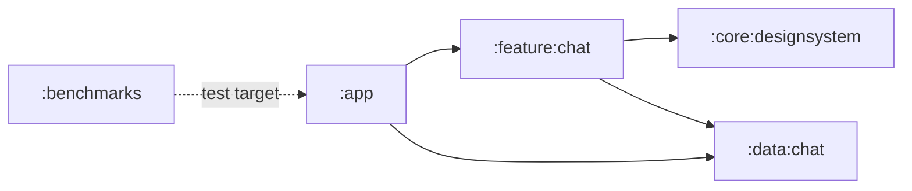

# Native Android personal chat foundation plan

**Status:** Implemented through production-hardening automation; external pilot gates remain

**Platform:** Native Android, Kotlin, Jetpack Compose

**Release boundary:** Native one-to-one text chat; group chat, calls, media, reactions,
search, and notifications remain excluded

**Prepared:** 2026-07-16

## Outcome

> Execution update (2026-07-16): the initial foundation and all three
> engineering follow-on milestones in this document are implemented under
> `apps/android`. The implementation includes the pure Kotlin state protocol,
> ViewModel, Room/Supabase adapter, auth, realtime/reconnect handling,
> idempotent sends, offline drafts, generated Baseline/Startup Profiles,
> macrobenchmarks, accessibility checks, and screenshot coverage. A local
> two-account Supabase end-to-end pass also covered auth, RLS history, sends,
> Realtime, read receipts, active network loss, draft restoration, reconnect,
> and backfill. The remaining deployment gates require external resources: the
> target Supabase environment, physical-device performance measurements,
> release signing/distribution credentials, and coach/target-client usability
> review.

The first Android milestone will produce a native, testable design-system and
component foundation for one-to-one messaging. It will not connect to Supabase,
send a real message, authenticate a user, or introduce any group, call, media,
notification, search, reaction, or conversation-creation behavior.

The milestone is complete when a debug-only component catalog and a stateless
personal-chat screen can render every required state with sample data in light
and dark themes, across compact and expanded Android windows, with passing
accessibility, semantics, contrast, screenshot, and component tests.

This split is intentional. It gives the product one visual and interaction
contract before networking and realtime state make UI changes more expensive.

## Binding product constraints

The Android work must follow these sources in precedence order:

1. `AGENTS.md` and `PRODUCT.md`
2. `DESIGN.md`, `DESIGN.json`, and the implemented tokens in
   `apps/web/app/globals.css`
3. `docs/ui-ux-agent-guidelines.md`
4. Android platform guidance

The product task is simple: a client reads and replies in one authorized
personal conversation; a coach reads and replies in one selected personal
conversation. The UI does not offer a gallery, a new-conversation chooser, or
unrelated destinations.

The single primary action in the thread is **Send message**. It appears only
when the draft contains sendable text. Back, retry, and navigation actions use
quiet treatments. A user with one authorized conversation opens it directly.
A list of conversations is only shown when the role already has more than one
authorized personal conversation.

### Scope included in the initial milestone

- Android project and Gradle convention foundation
- Cross-platform token manifest and Android token generation
- Light and dark `FishTheme`
- Color, typography, spacing, size, shape, border, elevation, icon, and motion
  systems
- Reusable generic Compose components
- Reusable one-to-one chat Compose components
- Stateless personal-chat screen and adaptive layout shell using sample data
- Component catalog and preview fixtures
- Automated visual, semantic, accessibility, and token-policy checks
- Manual real-device review checklist

### Scope excluded from the initial milestone

- Supabase SDK, auth sessions, repositories, Edge Function calls, or Realtime
- Kotlin implementation of the portable chat reducer
- Production `ViewModel` and navigation destinations
- Room, DataStore, offline send queues, background sync, or push notifications
- Message search, reactions, replies, edits, deletes, attachments, images,
  GIFs, stickers, or voice notes
- Presence beyond a static component state
- Group chat, community chat, audio calls, video calls, or a call dependency
- A new-conversation flow, contact picker, or client-visible conversation
  marketplace

Those exclusions are release gates, not merely prioritization notes. No module,
route, component parameter, placeholder action, or dependency for group chat or
calls should be added during this milestone.

## Architectural decisions

| Decision | Choice | Rationale |
| --- | --- | --- |
| UI toolkit | Jetpack Compose with Material 3 foundations | Compose is Android's recommended modern UI toolkit. Material components provide mature semantics, focus, interaction, and insets behavior, while FISH wrappers own the visible language. |
| Product theme | Custom `FishTheme` layered over stable Material 3 APIs | FISH needs more tokens than `MaterialTheme` exposes and must not inherit dynamic color, expressive elevation, or component defaults that conflict with its calm monochrome system. |
| Dynamic color | Off by default | Wallpaper-derived colors would break the implemented monochrome hierarchy and make cross-platform parity impossible. It can only be introduced later through an explicit design-system decision. |
| State flow | Stateless composables, immutable UI models, events upward | This follows Compose unidirectional data flow, keeps previews deterministic, and prevents components from depending on a `ViewModel`, repository, or SDK. |
| Native behavior parity | Reimplement behavior in Kotlin and test against the existing JSON vectors in a later phase | Android must not execute TypeScript or import web state libraries. Fixture replay provides testable parity without compromising native lifecycle and performance. |
| Module strategy | A small multi-module foundation with high cohesion | It creates useful visibility boundaries without turning every component into a Gradle module. New modules are added only when a real dependency boundary appears. |
| Navigation | Navigation 3 when production navigation begins | Navigation 3 is stable, Compose-first, and supports adaptive layouts. The initial component milestone needs only preview and debug catalog hosting. |
| Data SDK | No provider dependency in UI modules | Supabase's Kotlin client is community maintained. A future adapter must sit behind FISH-owned repository interfaces so SDK changes do not reach the screen or state machine. |
| Local cache | Add Room when real chat reads begin, not during the UI foundation | Room should become the Android read-model source for observable message windows. Supabase/Postgres remains authoritative for membership, RLS, and durable writes. |
| Minimum touch target | 48dp on Android | FISH's 44px web floor remains valid for web. Android's native accessibility floor is 48dp, so Android uses the stricter platform value while retaining 20dp icon glyphs. |
| Elevation | `0.dp` for FISH surfaces | Separation comes from semantic surface steps, spacing, borders, dividers, and scrims. Material component shadows are overridden. |
| Fonts | Bundled Lexend for UI/body and Fraunces for headings | This preserves the implemented product identity and offline rendering. Android uses `sp` and system font scaling. Fraunces never appears in controls or dense message metadata. |
| Icons | A curated `FishIcons` API backed by Tabler vectors | It preserves the existing 20px, 1.75-stroke visual language while preventing feature code from depending on icon filenames or a third-party Compose API. |

### Physical-use scene and theme choice

A client checks a coach's message on a phone between meetings, sometimes in a
bright office and sometimes during a dim commute. Android therefore follows
the system light or dark preference, preserves a manual preference if one is
added later, and never assumes one theme is the product default.

## Project structure

The Android build lives inside the existing monorepo but uses its own Gradle
wrapper and Kotlin DSL build. Root pnpm scripts may delegate to Gradle so CI and
developers still have one repository entry point.

```text
apps/android/
  settings.gradle.kts
  build.gradle.kts
  gradle.properties
  gradle/libs.versions.toml
  gradlew
  gradlew.bat
  build-logic/
    convention/
  app/
  core/
    designsystem/
  data/
    chat/
  feature/
    chat/
  benchmarks/

design/
  tokens/
    fish.tokens.json
  icons/
    LICENSE-tabler.txt
```

Responsibilities:

- `:app` owns the application, root theme, debug catalog host, and later the
  production composition root and navigation back stack.
- `:core:designsystem` owns generated tokens, fonts, `FishTheme`, `FishIcons`,
  and reusable branded FISH controls. It has no feature, data, Room, or
  Supabase dependency.
- `:data:chat` exposes the `ChatRepository` seam and chat data models. Room,
  Ktor, and Supabase remain internal packages because there is currently one
  application and one production adapter.
- `:feature:chat` owns chat-specific immutable UI models, controls, reducer,
  fixture parity tests, transcript, stateless screen, and ViewModel. It depends
  only on `:core:designsystem` and `:data:chat`.
- `:benchmarks` owns Baseline Profile generation and macrobenchmarks.



Do not create `:feature:groupchat`, `:feature:calls`, or generic
`isGroupChat`/`callsEnabled` flags. A later group-chat feature should compose
shared primitives around its own requirements instead of making the personal
chat component tree conditional and difficult to reason about.

## Design-token foundation

### Source-of-truth migration

The current implemented web CSS remains authoritative while Android is being
introduced. The first foundation task creates `design/tokens/fish.tokens.json`
from the shared subset of `apps/web/app/globals.css`, with `DESIGN.md` as the
narrative reference.

The migration should be staged:

1. Extract shared semantic values into the manifest without changing web
   rendering.
2. Generate immutable Kotlin token objects from that manifest.
3. Add parity tests that compare the manifest against the current web CSS and
   Android generated output.
4. Only after a zero-diff review, consider generating the web token block from
   the same manifest in a separate, explicitly scoped task.

This avoids a risky web rewrite while preventing Android from becoming a
second hand-maintained token source.

The manifest has three layers:

- **Reference tokens:** literal values such as OKLCH colors, dp/sp dimensions,
  durations, and font resources.
- **Semantic tokens:** roles such as canvas, surface, foreground, body,
  primary action, notice, divider, focus, message outgoing, and message
  incoming.
- **Component tokens:** recipes such as primary-button height, chat-bubble
  shape, composer maximum height, avatar size, and transcript width.

Feature code consumes semantic or component aliases only. It must not consume
raw reference values.

### Color and theme

Required Android roles:

- Canvas: `background`
- Surfaces: `surface`, `surfaceSubtle`, `surfaceHover`, `surfaceSelected`
- Identity: `avatar`
- Boundaries: `controlBorder`, `strongBorder`, `divider`, `focusBorder`
- Text: `foreground`, `body`, `muted`
- Primary action: `primary`, `primaryPressed`, `onPrimary`
- Feedback: `notice`, `error`, `warning`, `success`
- Overlay: `scrim`
- Chat aliases: `messageOutgoingContainer`, `onMessageOutgoing`,
  `messageIncomingContainer`, `onMessageIncoming`, `messageFailed`

The chat aliases initially map to the accepted web direct-chat roles. Keeping
them as aliases means message presentation can evolve without changing the
meaning of the primary-action token.

The generator converts canonical OKLCH values into explicit Android color
values and records conversion metadata. Tests verify every light and dark text
pair at WCAG AA and every meaningful control boundary at 3:1. No feature or
component file may contain a raw color literal.

### Typography

The Android type ladder mirrors the product roles, expressed in `sp`:

| Role | Font | Weight | Size | Line-height intent | Use |
| --- | --- | ---: | ---: | --- | --- |
| Display | Fraunces | 600 | 32sp | 1.1 | Rare compact product title |
| Heading | Fraunces | 600 | 20sp | 1.15 | Screen or section heading |
| Body | Lexend | 400 | 17sp | 1.55 | Message text and guidance |
| UI | Lexend | 400 | 15sp | Controls and compact UI |
| Label | Lexend | 500 | 14sp | Persistent labels |
| Caption | Lexend | 400 | 13sp | Secondary metadata only |

Use platform font scaling without caps. At large font scales, components grow
or reflow instead of truncating task-critical text. Message metadata may wrap
or move below a bubble. It may not overlap the message body or send control.

### Spacing, sizes, and shapes

Mirror the named FISH spacing scale as Android `Dp` tokens: `3xs`, `2xs`,
`nudge`, `xs`, `compact`, `sm`, `fieldY`, `md`, `page`, `lg`, `xl`, `2xl`,
`3xl`, and `4xl`.

Add Android-specific semantic size tokens:

- `touchTarget = 48.dp`
- `primaryControl = 56.dp`
- `iconGlyph = 20.dp`
- `chatHeader = 64.dp`
- `messageMaxWidthFraction = 0.85f`
- `chatContentMaxWidth = 720.dp`
- `conversationListWidth = 304.dp`
- `composerMaxHeight = 160.dp`

Required shapes:

- Card and chat: 16dp
- Control: 12dp
- Connected bubble inner corner: 4dp
- Pill: 50 percent / fully rounded

Raw `.dp` and `.sp` values are allowed only inside token definitions, platform
inset handling, and documented one-off platform APIs. Feature and component
code uses named tokens.

### Elevation and focus

All FISH components use zero tonal and shadow elevation. The implementation
must override Material defaults that introduce shadow or tonal elevation.

Keyboard, D-pad, and Switch Access focus must remain unmistakable. Android
will use a geometry-preserving tokenized focus treatment, proposed as an
inside 2dp `strongBorder` plus `surfaceSelected`, with no glow or shadow. This
closes the focus-spec gap recorded in the UI/UX guidelines and must be checked
in both themes before it is locked.

### Icons

`FishIcons` exposes semantic names, not library-specific names. The initial
set is intentionally small:

- Back
- Send
- Retry
- Close
- Person
- Lock
- Information
- Warning
- Check
- Delivered
- Read

Directional navigation icons use RTL-aware vectors. Icons are decorative by
default; the owning control supplies its localized accessible name. Icon-only
buttons retain a 48dp target and use a 20dp glyph.

### Motion

Motion is state feedback only:

- Fade: 200ms ease-out
- New message: 200ms opacity plus 6dp vertical settle
- Status confirmation: 180ms scale or opacity change
- Skeleton: calm opacity pulse, never shimmer

There is no bounce, elastic motion, parallax, or orchestrated screen entrance.
The design system exposes a motion policy so tests and users with system
animations disabled receive immediate state changes and no looping indicator.

## Compose component API rules

Every reusable composable follows these rules:

- State is passed in; user intent is passed out through callbacks or a narrow
  action sink.
- A composable never retrieves its own `ViewModel`, repository, navigation
  controller, Supabase client, or service locator.
- `Modifier` is exposed and applied to the root node.
- Public models are immutable. Collections used by high-frequency transcript
  components are immutable or wrapped in stable UI models after measurement
  shows a need.
- Slots are used for legitimate composition points. Boolean flags are not used
  to turn a personal-chat component into unrelated feature variants.
- Material components are wrapped in `:core:designsystem`; feature code does
  not style raw Material buttons, fields, cards, or alerts independently.
- All text is provided as localized resources or caller content. No
  user-facing string is assembled from fragments that break translation or
  RTL ordering.
- Every component has previews and tests for default, focused, pressed,
  disabled, loading, error, long-copy, and large-font states where applicable.

Use the current state-based Compose text-field APIs. `FishMessageComposer`
accepts a hoisted `TextFieldState`, preserves selection and composition, and
does not duplicate editable state internally. In the later behavior phase,
the screen `ViewModel` will adapt changes into the portable `draftChanged`
event and restore protocol drafts after process or send failures.

## Component inventory

### Core design-system components

| Component | Required variants and states |
| --- | --- |
| `FishButton` | Primary, secondary, ghost; default, pressed, focused, disabled, loading |
| `FishIconButton` | Solid, quiet; default, pressed, focused, disabled, selected |
| `FishTextField` | Default, focused, disabled, read-only, supporting text, notice, error |
| `FishSurface` | Canvas, surface, subtle, selected; zero elevation |
| `FishDivider` | Decorative hairline only, never a control boundary |
| `FishText` helpers | Product type roles without arbitrary per-call sizes |

### Shared UI components

| Component | Required variants and states |
| --- | --- |
| `FishAvatar` | Image, loading, failed image, initials, neutral fallback; non-clickable and clickable semantics |
| `FishUnreadBadge` | Hidden at zero, 1 to 99, capped 99+; stable width and spoken count |
| `FishNotice` | Notice, warning, error, success; icon plus actionable copy; persistent for required recovery |
| `FishEmptyState` | Title, description, optional single quiet or primary action |
| `FishSkeleton` | Text and avatar shapes; exact final geometry; motion-off state |
| `FishTopBar` | Title, optional back action, optional one quiet trailing action; edge-to-edge safe |
| `FishConversationRow` | Avatar, name, snippet, time, unread count, selected state; no swipe-only action |

### Personal-chat components

| Component | Required variants and states |
| --- | --- |
| `ChatTopBar` | Participant avatar, name, static presence label, optional back; no calls or overflow menu |
| `MessageBubble` | Incoming, outgoing, connected group corners, long text, links, deleted copy, failed state |
| `MessageGroup` | Groups adjacent messages by sender and time without repeating unnecessary visual metadata |
| `MessageDeliveryStatus` | Sending, sent, delivered, read, failed; visible text for the latest relevant outgoing message |
| `MessageDateSeparator` | Today, yesterday, localized date; semantic heading |
| `UnreadMessageDivider` | Plain `New messages` label, not a score or judgement |
| `TypingIndicator` | Static label plus restrained dots; one polite announcement per state transition; no loop with reduced motion |
| `OlderMessagesState` | Reserved geometry for idle, loading skeleton, calm failure, and manual retry |
| `ChatConnectionNotice` | Connecting, reconnecting, offline; draft-preservation copy and no automatic retry button loop |
| `FishMessageComposer` | Persistent `Message` label, multiline `TextFieldState`, 4,000-character rule, keyboard/IME behavior, send control, offline and busy states |
| `ChatTranscript` | Keyed lazy list, stable content types, scroll-position contract, loading and empty states |
| `ChatScreen` | Stateless composition of top bar, transcript, notices, and composer |
| `ChatAdaptiveLayout` | Single thread for compact or single-conversation users; list-detail only when multiple authorized conversations exist |

The initial composer contains text and Send only. Emoji, attachments, GIFs,
stickers, voice input, and reply previews are intentionally absent. Empty
drafts show no primary send control, matching the current web interaction
contract.

## Personal-chat visual and interaction contract

### Hierarchy

1. Participant identity and conversation context
2. Message transcript
3. Current connection or recovery state, only when needed
4. Message composer and Send message action

Incoming and outgoing bubbles use separate semantic aliases, alignment, and
connected-corner shapes. State never relies on hue alone. Message text uses
the 17sp body role. Metadata uses the caption role and must remain secondary,
but never too dim to pass contrast.

The transcript is a `LazyColumn` with stable message keys and content types.
Date separators, unread separators, pagination feedback, and messages are
separate lazy items so one visible item never forces unrelated rows to compose.
Performance is evaluated in a release build, not inferred from debug scrolling.

### Composer behavior

- The label `Message` remains visible; placeholder text does not act as the
  only label.
- The field grows to the named maximum height, then scrolls internally.
- Newline entry remains available. Send is always available as an explicit
  48dp control and may also be wired to an IME Send action when the active IME
  exposes one.
- Blank text is not sent. Validation occurs when Send is requested, with calm
  inline guidance instead of a permanently disabled mystery control.
- At 4,000 characters, the component shows a stable counter and plain limit
  guidance. The future command layer remains authoritative.
- While sending, the control retains its geometry, prevents duplicate
  activation, and exposes a busy state.
- Offline users may continue typing. The draft is not discarded. The notice
  says that the draft is saved and sending will be available after reconnect.

### Accessibility semantics

- Each message bubble is one useful TalkBack node containing sender, message,
  localized time, and outgoing status where relevant.
- Current-user messages are announced as `You`.
- Decorative avatars, checkmarks, and typing dots are excluded from the
  semantics tree when their meaning is already in text.
- Date and unread separators are headings, not focusable buttons.
- New incoming messages never steal focus. Status updates use the least
  interruptive live-region behavior that still exposes the change.
- Typing is announced once when it starts and once when it stops, never once
  per dot or animation frame.
- Every action has an outcome-specific accessible name such as `Send message`
  or `Try loading earlier messages again`.
- Hardware keyboard, D-pad, TalkBack, Switch Access, and touch all reach the
  same actions. No essential operation is swipe-only, long-press-only, or
  drag-only.

## Screen-state matrix

The stateless screen and component catalog must cover these states before real
feature code begins:

| State | Required presentation and recovery |
| --- | --- |
| Initial loading | Header and message skeletons that match final geometry; no blank screen |
| Empty conversation | `No messages yet` with one short explanation and the composer as the only action |
| Loaded conversation | Bounded newest-message window, localized date separators, stable scroll position |
| Loading earlier | Reserved top slot with quiet skeleton; transcript does not jump |
| Earlier-load failure | Calm inline explanation plus one secondary manual retry |
| Sending | Optimistic outgoing bubble and stable busy send control |
| Sent, delivered, read | Text status on the latest relevant outgoing message; no color-only cue |
| Send failure | Failed bubble plus calm guidance; future reducer restores the body only when no newer draft exists |
| Reconnecting | Neutral inline status; no modal, sound, or focus theft |
| Offline | Draft remains editable; message explains that sending waits for connection |
| Permission unavailable | `This conversation isn't available` and one safe return action when navigation exists |
| Long content | 4,000-character message, long name, long translated labels, URLs, emoji, and unbroken content |
| Large font / RTL | Reflow without overlap, clipped controls, or directional assumptions |
| Reduced motion | No message settle, pulsing loop, or animated scroll required to understand state |

## Adaptive Android behavior

- **Compact width:** One thread fills the usable window. The top bar includes a
  back action only when a real previous destination exists. The composer
  consumes IME and navigation-bar insets.
- **Medium width:** Keep one conversation as a centered, constrained thread.
  Do not add a second pane merely because space exists.
- **Expanded width:** Use list-detail only for roles with multiple authorized
  conversations. The selected conversation remains the only detail task. Do
  not add a third details pane in the initial milestone.
- **Foldables and desktop windows:** Use adaptive window information and hinge
  posture. Critical content and controls never sit under a separating hinge.
- **Edge-to-edge:** Enable edge-to-edge from the first activity, use
  `adjustResize`, and handle system bar and IME insets in the scaffold and
  composer. Do not apply the same inset twice.

When production navigation begins, use Navigation 3 keys and an adaptive
list-detail scene. Selection is navigation state, not a hidden mutable field in
the conversation list.

## Verification strategy

### Automated checks

1. **Token tests**
   - Manifest schema validation
   - CSS-to-manifest shared-role parity
   - Generated Kotlin is up to date
   - Light/dark contrast assertions
   - No shadow/elevation tokens above zero
   - No raw colors in component or feature source
   - No raw spacing or type sizes outside approved token files

2. **Component tests**
   - Semantics roles, names, state descriptions, enabled state, and click
     behavior
   - 48dp minimum interactive bounds
   - Focus order and geometry stability
   - Loading prevents duplicate action
   - Failed image falls back to initials or neutral avatar
   - Empty unread count removes the badge from semantics

3. **Compose accessibility checks**
   - Enable Compose accessibility checks in instrumented tests
   - Fail on missing labels, small targets, low contrast, and invalid traversal
     order

4. **Screenshot tests**
   - Official Compose preview screenshot testing
   - Light and dark
   - Compact phone, medium tablet, expanded tablet, and one fold posture
   - Font scales 1.0, 1.3, and 2.0
   - LTR and RTL
   - Default, loading, empty, offline, failed-send, and long-content states

5. **Performance checks**
   - Stable keys and `contentType` on transcript items
   - No unbounded message list in preview fixtures
   - Release-build scroll inspection with a realistic bounded message window
   - Recomposition metrics only after a measured issue; do not add stability
     annotations as guesses

### Manual device checks

- TalkBack read order and action names
- Switch Access and hardware keyboard traversal
- Gesture navigation and three-button navigation
- Software keyboard open, close, rotate, and split-screen behavior
- Android light/dark switching while the screen is open
- System animations disabled
- Large font, display size, and long English-learning content
- Low bandwidth and offline states once the real feature phase begins

## Implementation roadmap

Estimates are engineering days for one Android engineer and exclude product
review wait time. Each wave ends with a reviewable artifact and can be paused
without invalidating later work. The initial milestone totals approximately
20 to 29 engineering days.

### Initial milestone: Android personal chat UI foundation

#### Wave 0: Decisions and build scaffold, 2 to 3 days

- Record ADRs for module boundaries, token source migration, dynamic color,
  fonts, minimum SDK, Navigation 3, and the future Supabase adapter boundary.
- Use `minSdk 26` unless product reach data requires lower support. If lower
  support is required, record the desugaring and SDK consequences before
  choosing the chat data client.
- Add Gradle wrapper, Kotlin DSL, version catalog, Java/Kotlin toolchain,
  Compose BOM, convention plugins, lint, unit tests, and CI entry points.
- Add root commands such as `pnpm android:assemble`, `pnpm android:test`, and
  `pnpm android:check` that delegate to Gradle without introducing npm files.
- Create only the five modules listed above.

**Exit gate:** A themed empty debug app builds in CI; release and debug variants
resolve from one version catalog; no chat SDK or backend dependency exists.

#### Wave 1: Tokens and theme, 4 to 6 days

- Create the platform-neutral shared token manifest from current implemented
  web values.
- Generate Kotlin color, typography, spacing, size, shape, border, elevation,
  and motion objects.
- Bundle and license Lexend, Fraunces, and curated Tabler assets.
- Implement `FishTheme`, Material role mapping, system theme switching,
  edge-to-edge system bar appearance, and the motion policy.
- Implement token parity, contrast, no-shadow, and no-raw-value checks.

**Exit gate:** The token catalog renders identically in forced light and dark
themes; contrast tests pass; changing the manifest produces a deterministic
Android diff.

#### Wave 2: Core component library, 5 to 7 days

- Implement atomic design-system components, then shared avatar, badge,
  notice, empty-state, loading, top-bar, and conversation-row components.
- Build a debug-only catalog grouped by component and state, not a production
  settings or picker screen.
- Add state, semantics, focus, target-size, and screenshot tests with realistic
  copy.

**Exit gate:** Every component in the core inventory has required states,
preview coverage in both themes, and passing automated accessibility checks.

#### Wave 3: Personal-chat UI kit and stateless screen, 6 to 8 days

- Define immutable `ChatUiModel`, `MessageUiModel`, connection,
  pagination, and delivery presentation states. These contain no database or
  provider types.
- Implement message groups, bubbles, statuses, separators, typing, connection
  notice, composer, transcript, top bar, and adaptive layout.
- Compose `ChatScreen` from sample models and callbacks.
- Add the full screen-state matrix to previews and screenshots.
- Verify compact, medium, expanded, fold, IME, large-font, RTL, and
  reduced-motion behavior.

**Exit gate:** The static personal-chat screen demonstrates every required
state without a `ViewModel`, network, database, group, call, media, or
notification dependency.

#### Wave 4: Foundation acceptance, 3 to 5 days

- Run UI guideline review against every component and screen state.
- Run Compose accessibility checks, screenshot suite, lint, unit tests, and
  release build.
- Complete TalkBack, Switch Access, keyboard, IME, and real-device checks.
- Conduct a short usability review with a coach and at least one target client,
  focused on readability, message direction, send clarity, failure recovery,
  and return after interruption.
- Fix all release-level findings before freezing the component APIs.

**Exit gate:** The definition of done below is satisfied and component APIs are
versioned as the Android visual contract.

### Follow-on milestone 1: Native chat-state parity

Only after the UI foundation passes:

- Add pure chat state under `:feature:chat` with no Android, Compose, Supabase,
  Room, or navigation imports.
- Port `ChatState`, `ChatEvent`, reducer, and selectors idiomatically.
- Read `packages/core/src/chat-state/fixtures/chat-state-vectors.json` directly
  as test resources and replay every current fixture.
- Preserve bounded windows, duplicate reconciliation, unresolved-send
  hydration, monotonic sent status, atomic pagination failure, and Unicode
  code-point snippet rules exactly.
- Add a conversation-scoped `ViewModel` exposing immutable `StateFlow` and
  collecting it with `collectAsStateWithLifecycle` at the route boundary.
- Connect the stateless screen to a fake repository only.

**Exit gate:** All cross-platform fixture vectors pass and process recreation
preserves the active conversation and draft in the fake-data build.

### Follow-on milestone 2: Personal chat data integration

- Add `:data:chat` with a FISH-owned repository interface, domain-shaped data
  models, Room as the observable local read model, and an internal replaceable
  Supabase/Ktor remote adapter.
- Spike the community-maintained Supabase Kotlin client against auth refresh,
  PostgREST, Edge Functions, and Realtime before adopting it. Keep the SDK
  behind the adapter either way.
- Use RLS-protected direct reads; use the existing `send-message` Edge Function
  for sends; never make local state an authorization source.
- Synchronize a bounded newest window, keyset pagination, realtime hints, and
  reconnect backfill into Room.
- Preserve drafts offline. Do not queue silent offline sends in this slice;
  offer manual retry after connectivity returns.

**Exit gate:** Two authorized users can load, send, fail, retry, reconnect, and
read a one-to-one text conversation on real devices with no duplicates or lost
drafts.

### Follow-on milestone 3: Production hardening and pilot

- Add privacy-safe observability, redacted diagnostics, baseline profiles, and
  macrobenchmarks.
- Verify process death, background/foreground transitions, network switching,
  token refresh, realtime duplication, and long histories.
- Run a real-device matrix and a target-user pilot.
- Resolve the UI/UX guideline gaps for realtime announcements, destructive
  actions, high-contrast behavior, localization, and interruption policy
  before public release.

Group chat, calls, attachments, reactions, search, notifications, and other
messaging features remain separate future milestones. They must not be folded
into production hardening.

## Initial milestone definition of done

- [ ] Android project builds through the committed Gradle wrapper and root
  monorepo scripts.
- [ ] `:core:designsystem`, `:data:chat`, and `:feature:chat` have the dependency
  direction defined above with no cycles.
- [ ] Shared Android tokens are generated and parity-tested against the current
  web source for every shared role.
- [ ] Light and dark themes pass text and control contrast tests.
- [ ] Dynamic color and Material elevation are disabled.
- [ ] All Android actions have at least 48dp interaction bounds; primary
  controls use the 56dp token where appropriate.
- [ ] Every public component has required state previews and tests.
- [ ] The stateless screen covers loading, empty, normal, pagination loading
  and failure, sending, sent, delivered, read, failed, reconnecting, offline,
  unavailable, long-copy, RTL, large-font, and reduced-motion states.
- [ ] TalkBack reads message sender, body, time, and status in a useful order
  without announcing decorative content.
- [ ] Keyboard, D-pad, Switch Access, touch, IME, safe-area, and edge-to-edge
  checks pass on real devices.
- [ ] Screenshot tests pass for the agreed theme, window, font-scale, and RTL
  matrix.
- [ ] Feature and component code contains no raw color, spacing, typography,
  shape, elevation, or motion values outside approved token boundaries.
- [ ] No Supabase, Room, auth, realtime, group, call, media, reaction, search,
  or notification implementation is present.
- [ ] Coach and target-client usability review finds no blocking issue with
  direction, readability, send clarity, or recovery copy.

## Risks and early decision gates

| Risk | Mitigation |
| --- | --- |
| `DESIGN.json`, CSS, and Android drift | Stage the shared manifest, generate Android code, and add parity tests before changing web generation. |
| Material defaults reintroduce color, elevation, or motion | Wrap Material components, map every visible role, and prohibit raw Material components in feature code through module visibility and lint. |
| Over-modularization slows a small team | Start with five modules. Split data and pure chat state only when those dependencies enter the project. |
| The Supabase Kotlin SDK changes or lacks required behavior | Keep provider types behind FISH-owned ports and complete a focused auth/realtime spike before adoption. |
| Composer state diverges from the portable draft contract | Define one `ViewModel` adapter in the parity phase that owns `TextFieldState` and dispatches protocol draft events; components remain stateless. |
| Adaptive UI creates unnecessary client choices | Show list-detail only for multiple authorized conversations. A single assigned conversation always opens directly. |
| Large fonts make the transcript or composer unusable | Treat 2.0 font scale and long content as screenshot and real-device gates, not post-launch polish. |
| Accessibility status announcements become noisy | Announce state transitions once, use polite regions, and manually test with TalkBack before freezing semantics. |

## Current Android references

- [Android architecture recommendations](https://developer.android.com/topic/architecture/recommendations)
- [Compose UI architecture and unidirectional data flow](https://developer.android.com/develop/ui/compose/architecture)
- [Design systems in Compose](https://developer.android.com/develop/ui/compose/designsystems)
- [Android modularization guide](https://developer.android.com/topic/modularization)
- [Navigation 3](https://developer.android.com/guide/navigation/navigation-3)
- [Adaptive list-detail layouts](https://developer.android.com/develop/adaptive-apps/guides/list-detail)
- [Edge-to-edge Compose setup](https://developer.android.com/develop/ui/compose/system/setup-e2e)
- [State-based Compose text fields](https://developer.android.com/develop/ui/compose/text/user-input)
- [Compose accessibility API defaults](https://developer.android.com/develop/ui/compose/accessibility/api-defaults)
- [Compose accessibility testing](https://developer.android.com/develop/ui/compose/accessibility/testing)
- [Compose preview screenshot testing](https://developer.android.com/studio/preview/compose-screenshot-testing)
- [Supabase Kotlin installation](https://supabase.com/docs/reference/kotlin/installing)
- [Supabase Kotlin client status](https://supabase.com/docs/reference/kotlin/introduction)
