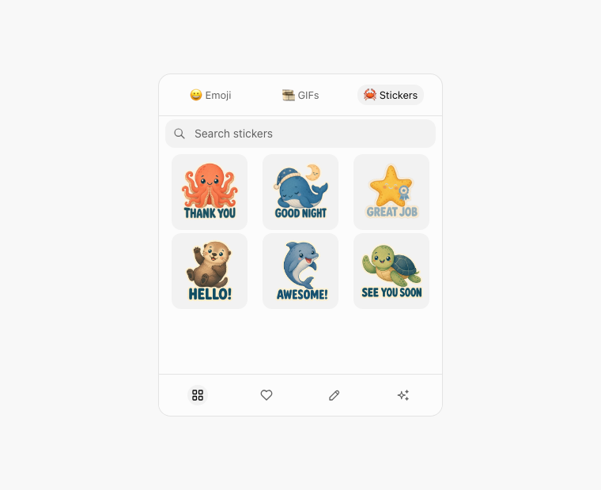
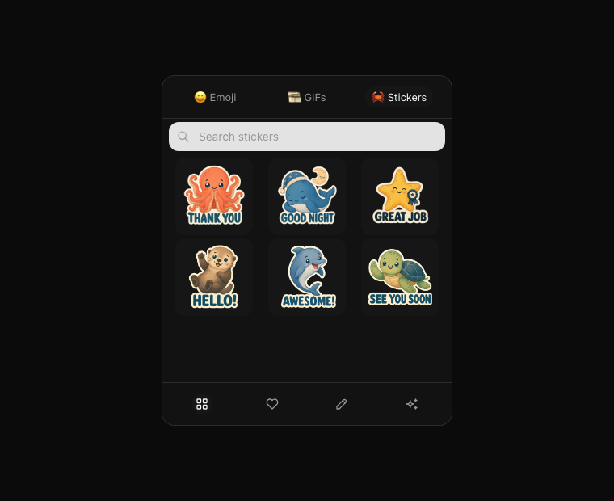

# Unified chat media picker

## Experience model

The composer exposes one expression trigger. It opens one popover with three
familiar tabs: 😀 Emoji, 🎞️ GIFs, and 🦀 Stickers. Search, browsing, scrolling,
selection, dismissal, keyboard behavior, and focus return all stay inside this
single shell.

Sticker discovery uses search plus one short style strip instead of a large
category menu. Add theme metadata and a second theme strip only after packs
span multiple real themes. This avoids a redundant `Aquatic` choice while
every available sticker is aquatic.

Recently used and favorites are intentionally deferred. Neither feature exists
in the current Emoji or GIF picker, and the initial 24-sticker catalog does not
justify new management controls. Add a single `Recent` section after real usage
provides meaningful history. Add favorites only if user testing shows that
search plus recent use is still too slow.

## Wireframe

```text
┌──────────────────────────────────────┐
│  😀 Emoji   🎞️ GIFs   🦀 Stickers   │
├──────────────────────────────────────┤
│  🔍 Search stickers                  │
│                                      │
├──────────────────────────────────────┤
│ ┌──────────┐ ┌──────────┐ ┌────────┐ │
│ │THANK YOU │ │GOOD NIGHT│ │GREAT   │ │
│ │ octopus  │ │  whale   │ │JOB     │ │
│ └──────────┘ └──────────┘ └────────┘ │
│ ┌──────────┐ ┌──────────┐ ┌────────┐ │
│ │ HELLO!   │ │ AWESOME! │ │SEE YOU │ │
│ │  otter   │ │ dolphin  │ │SOON    │ │
│ └──────────┘ └──────────┘ └────────┘ │
│                          scroll ↓     │
├──────────────────────────────────────┤
│  Style  [All] [Cute] [Sketch] →       │
└──────────────────────────────────────┘
```

The Storybook `Chat/MediaPicker/StickerBrowsing` story is the interactive
high-fidelity mockup. The same component is mounted from the production chat
composer.





## Sample art direction

The first six assets established the visual language for the 24-sticker pack:

- `Thank you`: grateful coral octopus, exactly eight visible arms.
- `Good night`: sleepy blue whale with two pectoral flippers and a horizontal
  tail fluke.
- `Great job`: proud golden sea star with exactly five radial arms.
- `Hello!`: cheerful sea otter waving one paw.
- `Awesome!`: energetic bottlenose dolphin in a curved leap.
- `See you soon`: friendly sea turtle with four flippers and a short tail.

All stickers use bold, baked-in text, a warm-white die-cut outline, restrained
ocean colors, rounded hand-drawn forms, and subtle paper texture. Transparent
WebP files stay readable at the 96px picker size while remaining compact enough
to bundle with the web application.

## Proposed aquatic pack

The default pack uses one unique aquatic animal per phrase. Do not reuse an
animal within this pack: distinct silhouettes make scanning faster and prevent
anatomy or character details from drifting between messages. Continue to
validate new phrases in real chat sessions and add future assets in small
batches.

| Phrase | Character | Pose and anatomy cue |
| --- | --- | --- |
| Thank you | Octopus | Two of eight arms held near its heart |
| You're welcome | Harbor seal | Two fore flippers and two hind flippers, gentle welcoming turn |
| Hello | Otter | Four limbs, natural tail, one paw raised |
| Goodbye | Squid | Eight arms plus two long feeding tentacles waving |
| Good morning | Seahorse | Upright segmented body and one curled prehensile tail beside a small sun |
| Good night | Whale | Two pectoral flippers and a horizontal tail fluke |
| Congratulations | Jellyfish | Clear bell and trailing tentacles with confetti |
| Sorry | Penguin | Two flipper-like wings and two webbed feet in a small bow |
| Please | Shrimp | Segmented body, antennae, walking legs, and a polite curled pose |
| Yes | Crab | Five limb pairs, first pair as claws, confident nod |
| No | Lobster | Five limb pairs, first pair as claws, gentle head shake |
| Okay | Manta ray | Broad diamond-shaped disc, two cephalic lobes, and one slender tail |
| Awesome | Dolphin | Natural pectoral fins, dorsal fin, and tail flukes in an upbeat leap |
| Great job | Sea star | Five radial arms and a small award ribbon |
| Good luck | Goldfish | Believable fin placement and an encouraging forward swim |
| Happy birthday | Narwhal | One tusk, two pectoral flippers, and a horizontal tail fluke |
| I miss you | Manatee | Two fore flippers and one rounded paddle tail framing a small heart |
| Love you | Angelfish | Compressed body with long dorsal, anal, and pelvic fins around a heart |
| LOL | Clownfish | Natural fins and tail in a clear laughing curve |
| OMG | Pufferfish | Inflated round body with believable fins and spines |
| Cheers | Walrus | Two tusks and four flippers, raising a shell cup |
| Welcome back | Sea lion | External ear flaps and four flippers in an open welcoming pose |
| See you soon | Sea turtle | Four flippers, shell, head, and short tail in a friendly wave |
| Nice! | Nudibranch | Two rhinophores and one feathery branchial plume in a proud pose |

Useful next phrases after the core set:

| Phrase | Character | Why it earns a place |
| --- | --- | --- |
| You got this | Sea turtle | Supportive coaching and work conversations |
| Sounds good | Dolphin | Fast agreement without a graded tone |
| Be right back | Crab | Common conversational status |
| On my way | Manta ray | Useful for appointments and meetups |
| Take care | Whale | Warm conversation close |
| Thinking of you | Jellyfish | Gentle support and reconnection |

## Discovery and scale recommendations

1. Search phrases, synonyms, animal names, moods, and styles. Add theme terms
   to the index when the catalog contains more than one theme.
2. Keep the style rail sticky while sticker results scroll and default it to
   `All`. Add a theme rail only when multiple real themes make it useful.
3. Sort by recent use first only after enough history exists. Do not show an
   empty `Recent` section.
4. Add favorites only after real usage proves they save time. A long-press or
   context action is preferable to placing a heart button on every tile.
5. Lazy-load sticker thumbnails and paginate large packs. Keep stable tile
   dimensions to avoid layout shifts.
6. Index pack ID, sticker ID, phrase, synonyms, style tags, and theme tags.
   Search should return stickers, not whole packs, so the desired phrase is one
   tap away.
7. Preserve the one-popover contract as formats grow. New sticker packs should
   add catalog data, not new composer buttons.
8. Run an anatomy checklist before export. Count limbs and tentacles at sketch,
   line-art, and final asset review stages.

## Production path

Sticker messages use a catalog-backed `sticker_id` stored on the message. The
corresponding WebP remains a bundled application asset, so sticker sends do not
create uploads or enter the image-attachment flow. The shared TypeScript
contract, Edge Function allowlist, database constraint, and UI catalog must
stay synchronized when the pack changes. Stable IDs allow artwork to be
updated without rewriting old messages and leave room for recent-use history
after real usage validates it.
