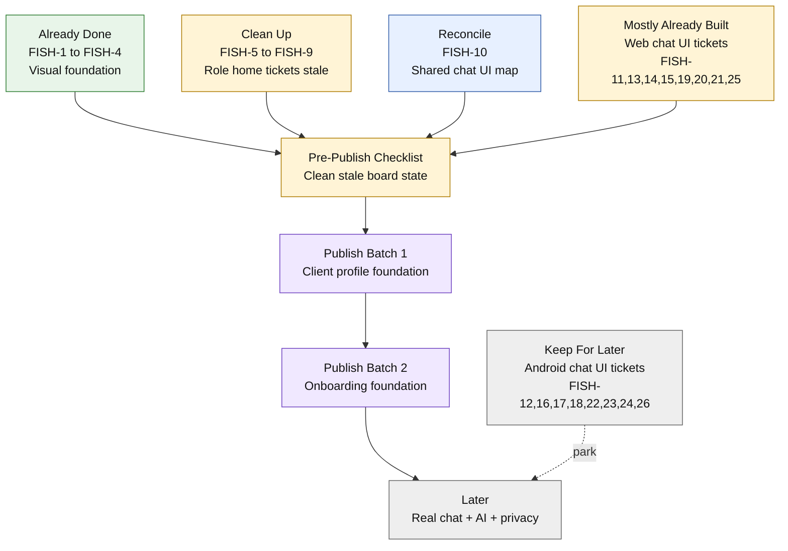

# Linear Pre-Publish Visual Map

Draft status: review only. Do not publish to Linear until Franz approves.
Linear changes made: none.
Last drafted: 2026-07-04.

## Why this exists

Before adding new tickets, we need to see the whole board at once:

- what is already done,
- what is stale and should be cleaned up,
- what should stay for later,
- what new tickets should be published first.

This keeps Linear from becoming confusing for non-developers and prevents the team from doing the same work twice.

## Current Linear Shape

Linear currently has 26 tickets:

| Group | Tickets | Current Linear state | Plain-English read |
| --- | --- | --- | --- |
| Visual foundation | `FISH-1` to `FISH-4` | Done | Already finished. Keep as history. |
| Role-aware home | `FISH-5` to `FISH-9` | Backlog / In Progress | Already implemented locally, but Linear still looks unfinished. Clean this up before publishing new work. |
| Shared chat UI plan | `FISH-10` | Backlog | Useful, but partly overtaken by implementation. Reconcile before keeping. |
| Web chat UI components | `FISH-11`, `FISH-13`, `FISH-14`, `FISH-15`, `FISH-19`, `FISH-20`, `FISH-21`, `FISH-25` | Backlog | Most web chat UI is already implemented locally. These should not stay as normal backlog work. |
| Android chat UI components | `FISH-12`, `FISH-16`, `FISH-17`, `FISH-18`, `FISH-22`, `FISH-23`, `FISH-24`, `FISH-26` | Backlog | Valid future UI work, but not urgent until the web product loop is real. |
| iOS | none | Empty project | No iOS work should be published yet unless we choose native scope. |
| Platform/backend | mostly missing | Very thin | This is the big gap: real product data, chat, privacy, AI, release work. |

## Visual Board

## Recommended Existing Ticket Actions

Do this before publishing new tickets.

| Ticket | Title | Recommended action before publishing |
| --- | --- | --- |
| `FISH-1` | Calm Visual Foundation | Keep Done. |
| `FISH-2` | Form, Card, and Progress Components | Keep Done. |
| `FISH-3` | Complete UI Preview | Keep Done. |
| `FISH-4` | Keyboard Focus and Accessibility Polish | Keep Done. |
| `FISH-5` | Role-Based Home Routing | Move to Done or close as completed locally. |
| `FISH-6` | Client Home | Move to Done or close as completed locally. |
| `FISH-7` | Coach Home | Move to Done or close as completed locally. |
| `FISH-8` | Role-Based Home Verification | Move to Done if final verification is accepted. |
| `FISH-9` | Finish Role-Aware Home Planning | Close as obsolete/completed planning. |
| `FISH-10` | Chat UI Experience Rules and Component Map | Reconcile. Keep only if it becomes the shared review ticket for Web/Android chat UI. |
| `FISH-11` | Web Chat UI Foundation | Move to Done if current web chat kit is accepted. |
| `FISH-12` | Android Chat UI Foundation | Keep for later. Not next sprint. |
| `FISH-13` | Web Message Display Components | Move to Done if current web chat kit is accepted. |
| `FISH-14` | Web Chat Input Components | Move to Done if current web chat kit is accepted. |
| `FISH-15` | Web Conversation List Components | Move to Done if current web chat kit is accepted. |
| `FISH-16` | Android Message Display Components | Keep for later. |
| `FISH-17` | Android Chat Input Components | Keep for later. |
| `FISH-18` | Android Conversation List Components | Keep for later. |
| `FISH-19` | Web Message Feedback Components | Move to Done if current web chat kit is accepted. |
| `FISH-20` | Web Media Message Components | Move to Done if current web chat kit is accepted. |
| `FISH-21` | Web Chat Empty, Loading, and Unread States | Move to Done if current web chat kit is accepted. |
| `FISH-22` | Android Message Feedback Components | Keep for later. |
| `FISH-23` | Android Media Message Components | Keep for later. |
| `FISH-24` | Android Chat Empty, Loading, and Unread States | Keep for later. |
| `FISH-25` | Web Chat Accessibility and Responsive Review | Either move to Done after review, or rewrite as a small final UAT ticket. |
| `FISH-26` | Android Chat Accessibility and Responsive Review | Keep for later after Android chat UI exists. |

## New Draft Tickets To Consider

These are the 8 sample publishable tickets drafted in `docs/linear-sample-gap-tickets-draft.md`.

| Draft | Title | Suggested publish timing |
| --- | --- | --- |
| New 01 | Client Profile Domain Schema | Publish first, Sprint 1. |
| New 02 | Data-Driven Onboarding Question Bank | Publish after profile schema starts. |
| New 03 | Onboarding Response Storage and Resume | Publish with or after question bank. |
| New 04 | Conversation and Message Schema | Do not publish yet unless we are ready to start real chat. |
| New 05 | Real Send Message Edge Function | Publish after conversation/message schema. |
| New 06 | Web Chat Route With Real Data | Publish after real send-message is planned. |
| New 07 | AI Provider Abstraction and Safe Reply Contract | Keep drafted, do not publish until real chat is working or nearly working. |
| New 08 | Privacy, Consent, Export, and Delete Baseline | Publish earlier than AI beta; can be drafted now, but should not bury Sprint 1. |

## Suggested Publish Batches

### Pre-publish checklist: Clean the board

Do this before adding new tickets. These are admin updates, not new tickets.

1. Move or close stale completed tickets after approval.
2. Park Android UI tickets until native work is active.
3. Optional: rewrite `FISH-10` as a short chat UI reconciliation note if it still helps.

Do not publish client profile/onboarding/chat tickets until stale tickets are handled.

### Batch 1: Start the next product foundation

Publish after the pre-publish checklist is approved.

1. New 01: Client Profile Domain Schema.
2. Remaining R01: Let Clients View And Update Their Profile.
3. Remaining R02: Coach Client Profile View.

### Batch 2: Prepare onboarding

Publish once the profile data model is underway.

1. New 02: Data-Driven Onboarding Question Bank.
2. New 03: Onboarding Response Storage and Resume.
3. Remaining R03: Data-Driven Onboarding Renderer.
4. Remaining R04: Coach Onboarding Review.

### Batch 3: Tracker engine

Publish after onboarding data foundations are underway.

1. Remaining R05: Tracker Configuration Schema.
2. Remaining R06: Tracker Assignment Command.
3. Remaining R07: Client Tracker Renderer.
4. Remaining R08: Coach Tracker Review.

### Batch 4: Real chat

Publish only after profiles and onboarding are no longer ambiguous.

1. New 04: Conversation and Message Schema.
2. New 05: Real Send Message Edge Function.
3. New 06: Web Chat Route With Real Data.
4. Remaining R09: Realtime, Presence, Typing, And Read State.
5. Remaining R10: Offline Drafts And Retry Queue.

### Batch 5: AI and privacy

Publish when real chat is close enough to test.

1. New 07: AI Provider Abstraction and Safe Reply Contract.
2. New 08: Privacy, Consent, Export, and Delete Baseline.
3. Later: AI reply pipeline, memory, safety, analytics, and release readiness.

## Sprint View

| Sprint | Main outcome | Existing tickets touched | New tickets |
| --- | --- | --- | --- |
| Pre-publish | Make Linear truthful | `FISH-5` to `FISH-25` cleanup/reconcile | none |
| Sprint 1 | Client profile data and client profile screen | none required | New 01, R01 |
| Sprint 2 | Coach profile view and onboarding data foundation | none required | R02, New 02, New 03 |
| Sprint 3 | Onboarding UI and coach review | none required | R03, R04 |
| Sprint 4 | Tracker engine foundation | none required | R05, R06 |
| Sprint 5 | Tracker client and coach loop | none required | R07, R08 |
| Sprint 6 | Real chat data foundation | existing web chat UI can be reused | New 04 |
| Sprint 7 | Real send + web chat route | existing web chat UI can be reused | New 05, New 06, R09, R10 |
| Later | AI, privacy, security, beta | none required | New 07, New 08, later tickets |

## Partner-Friendly Summary

Right now Linear looks like the team still needs to build a lot of UI that is already built locally. Before adding new tickets, clean that up. Then publish only the first few foundation tickets:

1. Build client profiles.
2. Build onboarding.
3. Build tracker engine.
4. Build real chat.
5. Add AI after real chat is real.
6. Add privacy/security/release work before beta.

That keeps the plan understandable and prevents the new tickets from landing on top of stale work.
