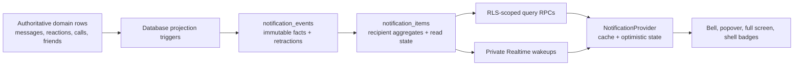

# Notification center implementation

This document is the production contract for FISH notifications and navigation
attention. It records the implemented architecture, the UX rules behind it,
and the operating constraints that should remain true as the Community Chat
surface grows.

## Product decision

FISH uses one calm, recipient-specific inbox instead of separate notification
centers for chat, friends, and calls. The bell answers one question: **what
deserves my attention now?** Channel and direct-message counters answer a
different question: **where is unread conversation activity?** Keeping those
models separate prevents the bell from becoming a duplicate inbox for every
message.

The system has three priority categories:

1. **Needs you** (`action_required`) — unresolved friend requests and
   moderation notices that require acknowledgement.
2. **For you** (`direct`) — mentions, replies, missed calls, and deliberately
   prominent system notices.
3. **Updates** (`update`) — reactions, accepted requests, completed-call
   history, announcements, and product updates.

The database sorts category priority first, then newest activity, then UUID as
a deterministic tie-breaker. The UI preserves that order and does not expose a
priority chooser.

## Architecture

Domain tables remain authoritative. A notification is a projection, never the
only record that a friend request, message, call, announcement, or moderation
action exists. Database triggers create or retract projection events in the
same transaction as the domain change. This removes dual-write failure modes
and lets all writers—including future Edge Functions—produce consistent
notifications.

The web receives hydrated content only through bounded RPCs. Realtime payloads
contain IDs, a monotonic change sequence, a reason, and a timestamp; they are
wake-up hints, not trusted notification content. On a hint, reconnect, browser
visibility change, or network recovery, the client requests changes and then
re-anchors to an authoritative page and summary.

## Data model

### `notification_events`

An event represents one deduplicated notification fact. It records the
recipient, type, actor, source domain IDs, occurrence time, metadata, and an
optional retraction time.

- `dedupe_key` makes retries idempotent.
- Source foreign keys make hydration and cleanup predictable.
- `retracted_at` preserves an audit trail while removing a fact from its
  aggregate.
- Actor and source deletes use safe foreign-key behavior; message and
  conversation deletion retract or cascades only the affected projection.

### `notification_items`

An item is the row shown in the inbox. It is unique by recipient and
`aggregate_key` and stores:

- type and priority category;
- active event count and latest event;
- first/last event time;
- independent `seen_at`, `read_at`, and `archived_at` timestamps;
- exact undo batch ID for clear operations;
- monotonic `change_seq` for incremental synchronization.

The state timestamps deliberately do not have to be later than event time.
That keeps acknowledgement safe under clock skew, imported history, and
future-dated demo data. Event time itself still preserves first-before-last
ordering.

### Source tables

- `system_announcements` holds bounded copy, audience role, category, active
  window, and an app-local action path.
- `moderation_actions` holds the protected reason, subject, action type, and
  acknowledgement state.
- Existing message, reaction, friend, block, call, profile, channel, and read
  state tables are unchanged as authorities.

All notification rows use recipient-only RLS. Announcement reads are limited
to active, applicable audiences. Moderation reads are recipient-only. Creation
of announcements and moderation actions is service-role-only.

## Type, grouping, and interaction contract

| Type | Category | Grouping key | Read behavior | Primary destination |
| --- | --- | --- | --- | --- |
| Friend request received | Needs you | One item per request | Stays visible until resolved | Request review |
| Friend request accepted | Updates | One item per accepted request | Normal read/clear | Friends |
| Moderation action | Needs you | One item per action | Cannot be bulk-cleared before acknowledgement | Local action or acknowledgement |
| System announcement | Updates or For you | One item per announcement | Normal read/clear | Safe local path, if present |
| Product update | Updates | One item per update | Normal read/clear | Safe local path, if present |
| Missed call | For you | Caller + UTC day | Unread | Call history/deep link |
| Completed call | Updates | One item per call and participant | Created already read | Call history/deep link |
| Mention | For you | Message + recipient | Unread | Exact message |
| Reply | For you | Message + recipient | Unread | Exact message |
| Reaction | Updates | Message + message author | Unread | Exact message |

Additional grouping rules:

- Multiple reactions to one message collapse into one row with actor and event
  counts. Removing a reaction retracts only that actor's event; the item
  disappears when no events remain.
- A mention and reply for the same recipient/message produce one direct item,
  with the mention taking precedence so the user is not alerted twice.
- Missed calls from the same caller collapse only within a UTC day. This
  prevents call spam without hiding a later-day follow-up.
- Friend requests never collapse into a generic “several requests” row because
  every request requires an independent decision.
- Edits that remove a mention and deletion of a source message retract the
  resulting notification.
- Blocking a person quietly archives social notifications between both users;
  it never emits a revealing “you were blocked” event.

## Feature-by-feature contracts

### Friend requests

1. **UX:** show each incoming request in **Needs you** and deep-link to its
   existing review screen. Acceptance creates a quiet update for the sender.
   The popover does not add accept/decline buttons because that would duplicate
   the focused request flow.
2. **Backend model:** `friend_requests` remains authoritative. Received and
   accepted facts project to separate event kinds; received facts retract on
   accept, decline, cancel, block, or other resolution.
3. **API/Realtime:** existing friend RPCs and `friend-command` perform the
   lifecycle. The friend topic wakes the request UI; the notification topic
   independently wakes the bell projection.
4. **Database:** one aggregate per request avoids merging independent choices.
   The pending-request count in `list_navigation_attention()` drives the
   Friends chip.
5. **Edges:** retries are idempotent, crossed requests do not auto-accept,
   unrelated users cannot read or respond, and blocks remove both users'
   social notification projections without revealing the block.
6. **Integration:** notification rendering reuses friend request and profile
   routes; the legacy `user_notifications` table remains compatible for older
   friend code but is no longer the web inbox source.

### Announcements and product updates

1. **UX:** show bounded title/body copy in **Updates**, or **For you** only when
   the publisher deliberately assigns higher prominence. A single optional
   local action can be shown; no carousel or chooser is introduced.
2. **Backend model:** `system_announcements` stores kind, audience role,
   active window, category, copy, and action path. Each applicable recipient
   gets one notification event.
3. **API/Realtime:** a service-only publish RPC provisions existing recipients
   transactionally and normal notification wakeups announce projection changes.
4. **Database:** role/audience and start/expiry constraints are enforced in
   SQL. A profile trigger provisions still-active announcements for new users.
5. **Edges:** external/protocol-relative links, empty copy, invalid windows,
   unsupported categories, and browser-authored publications are rejected.
6. **Integration:** the common notification list renders the copy; no separate
   announcement inbox or web API service is required.

### Moderation actions

1. **UX:** put acknowledgement-required notices at the top in **Needs you**,
   use calm guidance copy, and provide one **Got it** action or a safe local
   destination.
2. **Backend model:** `moderation_actions` stores the protected reason, action
   type, optional subject message, moderator, and acknowledgement status.
3. **API/Realtime:** moderators/services create actions through a service-only
   RPC. Recipients acknowledge through `notification-command`; private wakeups
   contain no moderation content.
4. **Database:** recipient-only RLS protects reasons. An unresolved action is
   excluded from bulk archive even if another action has marked it read.
5. **Edges:** deleted subject messages remain understandable, repeated
   acknowledgement is idempotent, and clear/undo cannot bypass resolution.
6. **Integration:** moderation uses the same provider and list but its explicit
   acknowledgement remains distinct from ordinary read state.

### Incoming, missed, and completed calls

1. **UX:** a ringing incoming call continues to use the dedicated call wakeup
   and call screen, where it is time-sensitive. If unanswered it becomes an
   unread **For you** item. A call that connected becomes read **Updates**
   history rather than new attention.
2. **Backend model:** `calls` remains authoritative. Status transitions project
   missed or completed events for the appropriate participants.
3. **API/Realtime:** existing call RPCs, call private topics, and provider
   webhooks own live state. The notification topic wakes only the durable
   missed/completed projection.
4. **Database:** missed calls group by caller and UTC day; connected calls use
   one aggregate per call/participant and are inserted read.
5. **Edges:** idempotent status retries cannot duplicate rows, network-failure
   completion remains history, and a call that never connected is not falsely
   presented as completed.
6. **Integration:** rows deep-link to the existing `/calls/[id]` route and do
   not introduce a second call state machine.

### Mentions and replies

1. **UX:** both appear in **For you**, name the actor, show a short safe message
   snippet and channel context, then focus the exact message on activation.
2. **Backend model:** structured `message_mentions` and reply source IDs drive
   directed events; notification copy is hydrated from the current message.
3. **API/Realtime:** existing message commands create/edit/delete the source.
   projection triggers send a minimal notification wakeup and conversation
   attention wakeup in the same transaction.
4. **Database:** aggregates are unique by message and recipient. Mention
   parsing is limited to usernames who are members of that conversation.
5. **Edges:** a mention suppresses a duplicate reply alert, editing away a
   mention retracts it, deletion retracts message notifications, and messages
   outside the loaded window are fetched before focus.
6. **Integration:** channel messages route to `/channels/[slug]`; direct
   messages route to `/messages/[conversation-id]`. Both share `ChatClient`.

### Reactions and other social updates

1. **UX:** reactions live in **Updates** and collapse into actor/event summaries
   such as “Sam and 2 others added 3 reactions.” They deep-link to the source
   message and never compete with direct mentions.
2. **Backend model:** every active reaction is an event; the visible item is an
   aggregate for the message author and message.
3. **API/Realtime:** the existing toggle-reaction RPC adds or soft-removes the
   domain row. Projection and attention triggers wake their authorized topics.
4. **Database:** distinct actor count is derived only from active events;
   event count changes transactionally as reactions are added or removed.
5. **Edges:** self-reactions do not notify, removed reactions retract only
   themselves, deleted messages remove the item, and repeated toggles remain
   deduplicated.
6. **Integration:** future low-priority social events should use the same
   `update` category and explicit aggregation key, but should not be added until
   the coach-first product rule validates their value.

## Popover and full-screen UX

Desktop uses a bounded popover anchored to the bell. Mobile uses the same list
model on `/notifications`, reached by a header link. Both surfaces provide:

- a single heading and overflow menu;
- `All` and `Unread` filters only;
- the three priority sections, omitted when empty;
- avatar/initial, concise event title, one supporting line, context and time;
- a quiet unread dot rather than a grade-like score on each row;
- `Load earlier` keyset pagination;
- bulk **Mark all as read** and **Clear read notifications** actions;
- exact-batch **Undo** after clearing;
- a calm status message when commands or synchronization cannot complete.

Opening the popover marks only the loaded, previously unseen items as seen.
Following a row marks that item read and navigates to its source. Message rows
include both a query parameter and fragment, request the target if it is
outside the current message window, scroll it into the center, and apply a
subtle surface highlight. Motion respects `prefers-reduced-motion`.

Action-required moderation uses an explicit **Got it** acknowledgement.
Unresolved action-required rows are excluded from bulk clear. Friend requests
resolve through the existing friend-request screen rather than adding competing
accept/decline buttons to the popover.

## Read, seen, archive, and badge semantics

- **Unseen** means the notification center has not presented the item yet. It
  lets the popover acknowledge what it has actually displayed without clearing
  unread bell attention.
- **Unread** means the user has not followed or explicitly acknowledged the
  item. It controls the bell count and unread filter.
- **Archived** means the item is removed from the active inbox. Archive is
  reversible by exact batch token.
- State transitions are monotonic in normal use. A bulk command is bounded by
  the summary's `latest_change_seq`, so a notification arriving after the
  click cannot be accidentally acknowledged.

Navigation attention comes directly from conversation read state, not from
notification items:

- Direct Messages shows an exact unread-message count.
- A channel shows an `@N` chip for unread mentions; otherwise it shows only a
  new-activity dot.
- Community aggregates channel mentions into `@N`; otherwise it shows a
  new-activity dot.
- Friends shows the exact number of pending incoming requests.
- The bell shows persisted unread notification items, capped visually at
  `99+` while retaining the exact accessible label.

Ordinary channel messages do not create bell notifications. This avoids noisy
double counting while still making conversation activity visible in place.

## Query and command APIs

Authenticated read RPCs:

- `get_notification_summary()`
- `list_notification_items(filter, cursor, limit)`
- `list_notification_changes(after_change_seq, limit)`
- `list_navigation_attention()`

Authenticated mutation RPCs are wrapped by `notification-command`:

- mark selected items seen;
- mark selected items read;
- mark all items read through a snapshot;
- archive read items through a snapshot;
- restore selected IDs or an exact archive batch;
- acknowledge a moderation action.

The Edge Function validates payloads, derives the caller from the JWT, invokes
only the relevant RPC, and maps failures to stable, non-scolding notices. It
does not accept a recipient ID from the browser. Service-only RPCs publish
announcements and create moderation actions.

## Realtime and offline synchronization

Supabase Realtime supplies the WebSocket transport.

- `notifications:user:<user-id>` is a private, recipient-authorized topic.
- `attention:conversation:<conversation-id>` is a private topic authorized by
  current conversation/channel membership.
- A conversation has one shared attention broadcast, not one fan-out message
  per member.
- Payloads intentionally exclude message bodies, display names, moderation
  reasons, and announcement copy.

The provider debounces bursts for 150 ms, asks for changes after its last
sequence, and performs a canonical page/summary refresh. It also refreshes on
online and visible events, making Realtime an acceleration layer rather than a
delivery guarantee.

Optimistic seen/read/archive operations store their affected rows and summary
deltas. Authoritative refreshes reapply pending overlays before render, so a
concurrent recovery cannot double-roll back or expose stale counts. A failed
command restores only its own operation and requests another canonical refresh.
Clear returns the database's batch UUID; undo never guesses which rows belong
to the action.

## Pagination, caching, and performance

- The authenticated layout server-renders the first notification page,
  summary, and navigation attention in parallel.
- The provider is the session cache shared by the shell, popover, and full
  screen. No second cache owns acknowledgement state.
- Feed pagination is keyset-based on category rank, last event time, and UUID;
  it never uses offset pagination.
- List RPCs return at most 50 visible rows plus one continuation sentinel.
- Incremental change reads return at most 500 rows before a canonical refresh.
- Partial indexes cover active feed order, unread rows, and recipient change
  sequence.
- Hydration truncates message snippets in SQL and returns only safe actor and
  source fields.

At larger scale, monitor active items per user, event-to-item ratio, change
catch-up size, Realtime reconnect rate, RPC latency, and archive volume. A
scheduled service-role maintenance job may hard-delete archived items and their
events after the product's agreed retention window; it must never delete
unresolved action-required items.

## Failure and security rules

- Realtime may be late, duplicated, or absent. RPC state always wins.
- Event emission is idempotent and can reactivate a previously retracted
  dedupe key when the domain fact becomes active again.
- Cursor parameters are all-or-none and server-bounded.
- Action links accept app-local paths only; protocol-relative and external
  URLs are rejected.
- Mention parsing resolves only visible usernames who are members of the
  conversation.
- Notifications are not emitted to the actor for their own message, reply,
  reaction, or call event.
- Completed calls are history, not new attention. Calls that never connect can
  become missed-call attention according to the call lifecycle.
- Copy or source deletion degrades safely (`Message deleted`, removed actor)
  without exposing inaccessible content.
- Unknown incremental changes force a canonical refresh rather than inventing
  partially hydrated UI rows.

## Integration map

- Migration and projection logic:
  `supabase/migrations/0031_notification_center.sql`
- Browser command boundary:
  `supabase/functions/notification-command/index.ts`
- Portable state machine:
  `packages/core/src/notification-state/`
- Supabase repositories and Realtime adapters:
  `apps/web/lib/services/supabase/notification-*` and attention adapters
- Provider and presentation:
  `apps/web/features/notifications/`
- Shell counters:
  `apps/web/components/shell/app-shell/app-shell.tsx`
- Message and direct-conversation destinations:
  authenticated channel/message routes and `ChatClient`
- Live verification:
  `scripts/verify-notifications.ts`

## Release and operational checklist

1. Apply the migration before deploying the web bundle or Edge Function.
2. Deploy `notification-command` and confirm JWT verification remains enabled.
3. Run generated database types and workspace typechecks.
4. Run `pnpm verify:notifications` against the target Supabase environment
   using disposable test accounts; do not run destructive local cleanup logic
   against production data.
5. Confirm private Realtime authorization for own/foreign recipient and
   conversation topics.
6. Smoke-test one event from every domain producer: friend request, moderation,
   announcement, missed/completed call, mention/edit retraction, reply, and
   reaction add/remove.
7. Verify desktop popover, mobile screen, keyboard focus return, offline
   recovery, bulk snapshot safety, and exact undo.
8. Watch database and Edge Function errors during rollout. A notification
   projection failure should block its source transaction rather than silently
   diverge.
