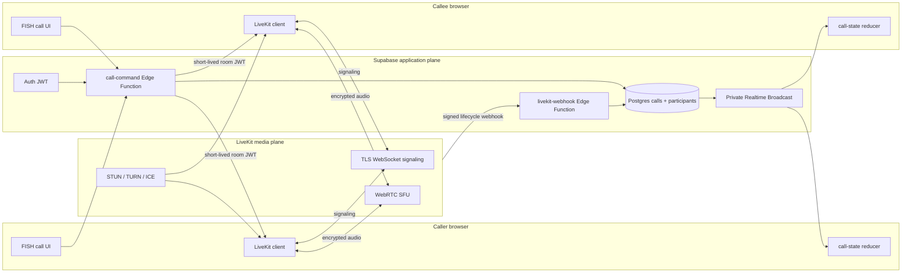
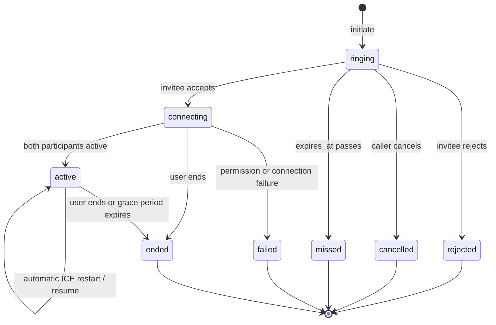
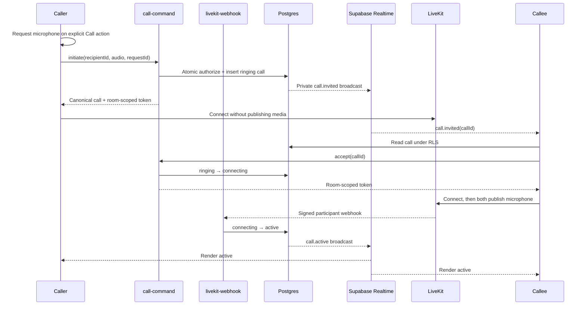

# Real-time calling architecture and implementation plan

**Status:** Secure control plane plus local one-to-one voice and video slices implemented; real-device, network, privacy, and pilot gates remain
**Prepared:** 2026-07-12
**First delivery target:** One-to-one voice calls between an assigned coach and client
**Later targets:** One-to-one video, group voice, group video, recording, screen sharing, and quality monitoring

## Executive decision

Use two deliberately separate planes:

- **Supabase remains the application control plane.** It owns authentication, coach-client authorization, durable call state, call invitations, lifecycle commands, audit metadata, and recovery after missed realtime events.
- **LiveKit Cloud is the managed media plane.** It owns WebRTC signaling over WebSocket, the SFU, ICE negotiation, STUN/TURN, media routing, reconnection, device tracks, and later group/video/recording capabilities.

Do **not** add Express, Socket.IO, or a custom WebSocket signaling server. Do **not** implement raw `RTCPeerConnection` negotiation for the production MVP. WebRTC does not define its own signaling protocol, TURN is necessary for restrictive networks, and operating signaling plus global TURN correctly is a separate reliability product. LiveKit already supplies these pieces and has JavaScript, Swift, and Android SDKs, which fits FISH's future cross-platform direction. [WebRTC peer-connection guide](https://webrtc.org/getting-started/peer-connections), [LiveKit connection model](https://docs.livekit.io/intro/basics/connect/)

The MVP should be **audio-only in product behavior**, even though the provider and database model are video/group-capable. Issue tokens that permit only microphone publication. Camera, screen-share, recording, and group invitations remain disabled until their later milestones.

## Why this choice fits FISH

The repository already has:

- Supabase Auth and role-protected profiles.
- `coach_clients` assignments and `private.is_conversation_member(...)` authorization.
- Durable `coach_clients` assignments and one-to-one membership semantics.
- Command-style Edge Functions and idempotent RPC patterns.
- Supabase Realtime lifecycle handling with reconnect recovery.
- A portable reducer-and-fixture pattern in `@fish/core/chat-state`.
- A strict, calm UI system with one primary action per view.

Calling is a communication foundation, not a learning exercise, so it does not require validation of a teaching technique. It still needs a short coach/client usability validation before general rollout: ringing behavior, permission copy, interruption handling, and whether an unscheduled call is socially appropriate.

One repository-specific issue must be handled explicitly: `/channels/:id` is currently the canonical community chat surface and the old one-to-one `/chat` route was removed. Personal calls must authorize directly against `coach_clients` and must **not** be launched as if a community channel were a private relationship. The MVP entry points should be the assigned-coach card for clients and client detail for coaches, with the active call on `/calls/[id]`. Referencing the assignment rather than a chat conversation also avoids accidentally treating the seeded community conversation as a personal call target.

## Technology recommendation

| Concern | Recommendation | Reason |
|---|---|---|
| Browser media SDK | `livekit-client` | Low-level enough for a FISH-specific calm UI; supports audio/video, devices, reconnect, screen share, and connection quality. |
| React integration | Thin FISH hooks around `livekit-client`; optionally use focused hooks from `@livekit/components-react` | Avoid importing LiveKit's meeting-style visual system or controls that would violate FISH's choice-reduction rules. |
| Token/server SDK | `livekit-server-sdk` inside Supabase Edge Functions | Supports Deno and keeps API secrets off the browser. The SDK creates room-scoped JWT grants. [Server SDK](https://docs.livekit.io/reference/server-sdk-js/) |
| Application commands | Supabase Edge Function `call-command` | Matches the existing sensitive-write boundary. |
| Durable state | Postgres tables with RLS and command-only writes | Realtime events are wakeups, not the source of truth. |
| Invitation delivery | Supabase Realtime Broadcast on private per-user topics | Reuses the existing realtime connection and JWT/RLS authorization. Supabase recommends private channels for production. [Realtime authorization](https://supabase.com/docs/guides/realtime/authorization) |
| WebRTC signaling | LiveKit signaling WebSocket | No application-owned SDP/ICE exchange or Socket.IO server. |
| Media topology | LiveKit SFU from the start | One code path for 1:1 and groups; each participant uploads once. |
| STUN/TURN | Managed by LiveKit Cloud | Includes UDP, TCP, TURN/UDP, and TURN/TLS fallback plus automatic ICE restart/reconnect. [Connection reliability](https://docs.livekit.io/intro/basics/connect/) |
| Local media server | `livekit-server --dev` | Local WebRTC development without using production infrastructure. [Local LiveKit](https://docs.livekit.io/transport/self-hosting/local/) |
| State machine | New portable `@fish/core/call-state` reducer plus JSON vectors | Mirrors the proven cross-platform chat-state architecture. |
| Validation | Zod at Edge Function and client boundaries | Already used by the web app; validates action unions and provider webhook payloads. |
| Observability | Structured application events plus LiveKit connection-quality events; provider analytics at rollout | Avoid storing raw media or high-frequency stats in Postgres. |

### Options considered

| Option | MVP advantage | Main cost | Decision |
|---|---|---|---|
| Raw WebRTC + Supabase Broadcast + managed TURN | Direct 1:1 media and minimal provider coupling | FISH owns SDP/ICE races, renegotiation, browser quirks, TURN credentials, reconnect, observability, and a later SFU migration | Reject for production; acceptable only as a disposable learning spike. |
| LiveKit Cloud | Future-proof SFU, TURN, reconnect, native SDKs, E2EE, recording, and quality events | Adds a media vendor and media-processing region/privacy review | **Recommended.** |
| Self-hosted LiveKit | Maximum infrastructure and data-plane control | Redis, TLS/load balancing, TURN, UDP ports, regional routing, autoscaling, upgrades, and on-call burden | Defer until usage, compliance, or economics prove it necessary. |
| Twilio Video | Mature global media, diagnostics, and recordings | Higher abstraction/vendor cost and less open/self-hostable path | Viable enterprise alternative. Twilio currently prices Group Rooms per participant-minute. [Twilio overview](https://www.twilio.com/docs/video/overview) |
| Cloudflare Realtime | Attractive edge footprint and egress pricing | Its lower-level SFU option requires more application WebRTC logic; RealtimeKit would need a separate product-fit spike | Revisit if LiveKit cost or regional performance fails the pilot. [Cloudflare Realtime](https://developers.cloudflare.com/realtime/) |

As of 2026-07-12, LiveKit's public Build plan lists 5,000 included WebRTC minutes, 50 GB downstream transfer, and 100 concurrent connections; production pricing and compliance features vary by plan and must be rechecked before launch. [LiveKit pricing](https://livekit.com/pricing)

## Target architecture



The application has two different kinds of realtime traffic:

1. **Call control:** invite, accept, reject, cancel, end, and durable status recovery. Supabase owns this.
2. **Media session signaling:** room join, offer/answer details, ICE, track publication, subscriptions, and reconnection. LiveKit owns this.

Keeping these separate prevents an ephemeral signaling event from becoming business truth. A client that misses `call.invited` queries the RLS-protected `calls` table on initial load and after Realtime reconnect.

## Authentication and authorization flow

1. The browser has a Supabase session JWT.
2. `supabase.functions.invoke("call-command", ...)` sends that JWT in `Authorization`.
3. The Edge Function verifies the authenticated user. Supabase documents that signed-in function calls carry the user JWT and recommends keeping JWT verification enabled for user-only functions. [Securing Edge Functions](https://supabase.com/docs/guides/functions/auth)
4. The command executes an atomic database RPC. The RPC verifies that:
   - the call's `(coach_id, client_id)` still exists in `coach_clients`;
   - the user is the assigned coach or client;
   - the requested transition is legal;
   - neither participant has another non-terminal call;
   - initiation rate limits are not exceeded.
5. Only after the database transition succeeds does the function mint a LiveKit JWT.
6. The LiveKit token contains:
   - `sub`/identity = the Supabase user UUID;
   - the opaque LiveKit room name for exactly one call;
   - `roomJoin: true`;
   - `canSubscribe: true`;
   - `canPublish: true`;
   - `canPublishSources: [microphone]` for the voice MVP;
   - no room-admin or recording grant;
   - a short initial-connect TTL, recommended five minutes.
7. The browser connects directly to LiveKit using the public `wss://` URL and token. Tokens must be generated on a backend because signing requires the API secret; short TTLs reduce replay risk. [LiveKit authentication](https://docs.livekit.io/home/concepts/authentication/), [tokens and grants](https://docs.livekit.io/frontends/reference/tokens-grants/)
8. A signed LiveKit webhook updates participant join/leave timestamps and reconciles active/ended status. The webhook never trusts user-supplied identity or room data without matching the stored call.

### Private invitation topics

Use one topic per authenticated user: `calls:user:<user_uuid>`. A database trigger sends only minimal payloads such as `{ callId, event, occurredAt }`. The client then reads the authorized row from Postgres.

Create `SELECT` authorization on `realtime.messages` that permits only the UUID owner of the topic and only the `broadcast` extension. Do not grant client `INSERT` permission for these topics; all lifecycle broadcasts originate from database transitions or the trusted Edge Function. Instantiate with `config: { private: true }`, call `supabase.realtime.setAuth()`, and disable public-channel access in production Realtime settings. Supabase evaluates channel access through RLS and `realtime.topic()`. [Realtime Authorization](https://supabase.com/docs/guides/realtime/authorization)

Realtime Broadcast Authorization is still described by Supabase as a beta-stage feature. Treat that as a pilot risk: verify it in the target Supabase plan and environment. If its production posture is unacceptable, keep the same durable tables and replace only the invitation wakeup with RLS-filtered Postgres Changes or a small `call_notifications` outbox subscription; the call lifecycle and media architecture do not change.

## Database design

Add one migration, initially `supabase/migrations/0020_calls.sql` if no migration lands first.

### `calls`

| Column | Type | Notes |
|---|---|---|
| `id` | `uuid` | Primary key. |
| `coach_id` | `uuid` | Assigned coach at call creation; references `profiles`. |
| `client_id` | `uuid` | Assigned client at call creation; references `profiles`. |
| `initiated_by` | `uuid` | Foreign key to `profiles`. |
| `kind` | enum | `audio` in MVP; later `video`. |
| `status` | enum | `ringing`, `connecting`, `active`, `ended`, `rejected`, `cancelled`, `missed`, `failed`. |
| `provider` | text | Fixed `livekit`; makes the service boundary explicit. |
| `provider_room_name` | text | Opaque random value, unique; never derived from email or display name. |
| `client_request_id` | text | Makes initiation idempotent per caller. |
| `expires_at` | timestamptz | Ring deadline; recommended 45 seconds. |
| `accepted_at` | timestamptz | Set by the accept transition. |
| `connected_at` | timestamptz | Set when both participants are active in the media room. |
| `ended_at` | timestamptz | Terminal timestamp. |
| `ended_by` | uuid nullable | User who explicitly ended/rejected/cancelled. |
| `end_reason` | enum nullable | `completed`, `rejected`, `caller_cancelled`, `no_answer`, `permission_denied`, `connect_failed`, `network_lost`, `provider_error`. |
| `created_at`, `updated_at` | timestamptz | Audit and ordering. |

Constraints:

- Unique `(initiated_by, client_request_id)`.
- `accepted_at`, `connected_at`, and `ended_at` must be chronologically ordered when present.
- A terminal status requires `ended_at` and `end_reason`.
- Creation and rejoin check the current `(coach_id, client_id)` assignment transactionally. The call does not foreign-key to `coach_clients`, preserving historical call metadata after reassignment while still revoking future joins.
- `initiated_by` must equal either `coach_id` or `client_id`.

### `call_participants`

Use a participant table from day one so group calls preserve the participant, event, token, and UI-state model even though the parent `calls` context gains group-specific columns later.

| Column | Type | Notes |
|---|---|---|
| `call_id` | uuid | Foreign key to `calls`, cascade delete. |
| `user_id` | uuid | Foreign key to `profiles`. |
| `role` | enum | `host` or `invitee`; later `moderator` and `member`. |
| `invitation_status` | enum | `invited`, `accepted`, `rejected`. |
| `joined_at`, `left_at` | timestamptz nullable | Provider-reconciled presence. |
| `reconnect_count` | integer | Increment only after a full provider reconnect. |
| `created_at`, `updated_at` | timestamptz | Audit. |

Primary key: `(call_id, user_id)`.

### `call_events`

Store low-volume, non-media audit events and webhook idempotency:

- `id`, `call_id`, `provider_event_id` unique, `event_type`, `actor_id`, `metadata jsonb`, `occurred_at`, `created_at`.
- Permit only service-role inserts.
- Whitelist metadata keys; never store tokens, SDP, ICE candidates, device labels, IP addresses, or E2EE keys.
- Set a retention job, recommended 90 days initially, subject to the privacy policy.

### RLS and write policy

- Members may `SELECT` calls and participants only when their own `user_id` appears in `call_participants`.
- No authenticated direct insert/update/delete grants on call lifecycle tables.
- All transitions go through security-definer RPCs invoked by `call-command`.
- Webhook reconciliation uses a service client but still checks stored room/call identity.
- Add live assertions to `scripts/verify-rls.ts`: participant read, unrelated-user denial, client mutation denial, stale-assignment denial, and cross-call token denial.

### Atomic RPCs

Prefer a single `transition_call(...)` RPC or narrowly named functions:

- `initiate_call(recipient_id, kind, client_request_id)`
- `accept_call(call_id)`
- `reject_call(call_id)`
- `cancel_call(call_id)`
- `end_call(call_id)`
- `expire_stale_calls(now)`

Each transition uses row locks and compare-and-set status checks. Lock both user identities in stable UUID order before checking for another live call, preventing simultaneous cross-calls. Return the canonical row after every idempotent transition.

## API design

### `call-command` Edge Function

One authenticated endpoint with a discriminated action union matches the existing `chat-command` pattern.

#### Initiate

```json
{
  "action": "initiate",
  "recipientId": "uuid",
  "kind": "audio",
  "clientRequestId": "uuid"
}
```

Success:

```json
{
  "call": { "id": "uuid", "status": "ringing", "expiresAt": "ISO-8601" }
}
```

The caller requests microphone permission before initiation but does not join the media room while it rings. After the callee accepts, both participants request a fresh, microphone-scoped room token and connect. This makes pre-accept audio publication impossible even for a modified browser client. If authorization or initiation fails, stop the preflight track immediately. The room stays in application status `ringing` until the callee accepts.

#### Accept

```json
{ "action": "accept", "callId": "uuid" }
```

Atomically changes `ringing` to `connecting` and returns the callee's room token. A second identical accept returns the same canonical call state and a fresh join token if still authorized.

#### Reject, cancel, and end

```json
{ "action": "reject", "callId": "uuid" }
{ "action": "cancel", "callId": "uuid" }
{ "action": "end", "callId": "uuid" }
```

- Only the invitee may reject.
- Only the initiator may cancel a ringing call.
- Either participant may end a connecting/active call.
- Terminal commands are idempotent.

#### Rejoin

```json
{ "action": "join", "callId": "uuid" }
```

Returns a fresh token only if the user is a participant and the call is `connecting` or `active`. This supports reload recovery; normal LiveKit reconnects do not need a new application token.

#### Common errors

Return stable machine codes and calm client notices:

| HTTP | Code | User-facing direction |
|---|---|---|
| 401 | `not_authenticated` | Redirect to sign in. |
| 403 | `call_not_allowed` | “This call is no longer available.” |
| 409 | `participant_busy` | “They’re already in a call. Try again a little later.” |
| 409 | `call_already_finished` | “This call has ended.” |
| 429 | `call_rate_limited` | “Give it a moment before calling again.” |
| 503 | `media_unavailable` | “Calling is taking a break. Messages still work.” |

Do not reveal whether an arbitrary UUID belongs to another user.

### `livekit-webhook` Edge Function

- Public platform route with Supabase JWT verification disabled because LiveKit is the caller.
- Verify the LiveKit signature with the server SDK/API secret before parsing.
- Accept room/participant events, deduplicate on provider event ID, and map only known opaque room names.
- Update `joined_at`, `left_at`, `connected_at`, reconnect/terminal state, and audit events.
- Return 2xx for a previously processed event.
- Never create an authorized participant solely because a webhook says that identity joined.

### Stale-call cleanup

Run `expire_stale_calls(now())` every minute with Supabase Cron or a scheduled Edge Function. It marks expired ringing calls as `missed`, closes connecting calls that never form a two-party media session within a bounded window, and reconciles orphaned active calls after webhook/provider failures.

## Call lifecycle



### Initiate sequence



### Lifecycle rules

- **Permission:** Request microphone only from an explicit `Call coach`/`Call client` gesture. `getUserMedia()` requires HTTPS and user permission; the promise may remain unresolved if the user ignores it. [MDN getUserMedia](https://developer.mozilla.org/en-US/docs/Web/API/MediaDevices/getUserMedia)
- **Ringing:** Default deadline 45 seconds. The countdown is informational, not a choice. The server's `expires_at` is authoritative.
- **Accept/reject:** Incoming view has one primary `Answer call` action and a quiet `Not now` secondary action.
- **Connecting:** Show one calm state and an `End call` action. Do not expose codec/ICE details.
- **Active:** Show participant name, duration, mute, and end. Device settings live behind one secondary `Audio settings` disclosure.
- **Reconnect:** LiveKit first attempts signal resume and ICE restart, then full reconnect. Keep the call active through a recommended 20-second grace period and show “Connection is coming back…” rather than immediately ending. [LiveKit reconnection](https://docs.livekit.io/intro/basics/connect/)
- **End:** Stop/unpublish local tracks, disconnect the room, execute the idempotent end command, and navigate back to the originating relationship screen. Always stop tracks on unmount, sign-out, identity change, page crash recovery, and terminal state.
- **Reload:** On `/calls/[id]`, read the call under RLS. If active/connecting, invoke `join` for a fresh token. Otherwise show the terminal summary and one navigation action.

## Media and device handling

### Voice MVP constraints

- Publish only an audio track with echo cancellation, noise suppression, and automatic gain control enabled where supported.
- Start with the operating system's default microphone and speaker. Do not force a device picker before every call.
- After permission is granted, list microphones through LiveKit/`enumerateDevices()` and allow switching via `room.switchActiveDevice("audioinput", deviceId)`.
- Offer output-device selection only when `setSinkId` is supported. Otherwise show “Your browser uses the system speaker setting.” Device output APIs vary by browser. [LiveKit device APIs](https://docs.livekit.io/reference/client-sdk-js/), [MDN audio output selection](https://developer.mozilla.org/en-US/docs/Web/API/AudioContext/setSinkId)
- Handle device removal through media-device events; fall back to the default device and show a notice.
- Attach remote audio to one managed renderer. If autoplay is blocked, show one primary `Hear call` action until audio playback is unlocked.
- Mute by disabling/unpublishing the local microphone track through LiveKit, not by merely lowering an HTML element's volume.

### UI surfaces and component placement

All implementations follow the required same-named folder structure and reuse the base FISH components.

Proposed files:

```text
packages/core/src/call-state/
  index.ts
  types.ts
  reducer.ts
  selectors.ts
  fixtures/call-state-vectors.json

apps/web/features/calls/
  index.ts
  contracts.ts
  model/
  client/
  server/
  components/
    call-entry-action/
      call-entry-action.tsx
      call-entry-action.test.tsx
      call-entry-action.stories.tsx
      index.ts
    incoming-call/
      incoming-call.tsx
      incoming-call.test.tsx
      incoming-call.stories.tsx
      index.ts
    active-call/
      active-call.tsx
      active-call.test.tsx
      active-call.stories.tsx
      index.ts
    call-controls/
      call-controls.tsx
      call-controls.test.tsx
      call-controls.stories.tsx
      index.ts
    audio-settings/
      audio-settings.tsx
      audio-settings.test.tsx
      audio-settings.stories.tsx
      index.ts

apps/web/app/(authenticated)/calls/[id]/
  page.tsx
  loading.tsx
```

UI rules:

- Incoming call: `Answer call` is the one primary action; `Not now` is secondary/ghost.
- Active voice call: the participant and connection state dominate. `End call` is the single emphasized action. `Mute` and `Audio settings` are quieter controls with 56px minimum targets.
- Never show a grid of people/devices/plans in the 1:1 flow.
- Do not use alarming red for decline, failure, or end. Use existing semantic notice/error tokens and calm guidance.
- Respect reduced motion: ringing uses no pulsing animation when reduced motion is enabled.
- Do not use LiveKit's default meeting control bar unchanged; it adds choices FISH does not need.

## Frontend service boundaries

Add provider-neutral contracts to `apps/web/lib/services/contracts.ts` or a feature-local intentional public subset:

- `CallCommandService`
- `CallRealtimeService`
- `CallMediaService`
- `CallDeviceService`

Implement:

- `apps/web/lib/services/supabase/call-command-service.ts`
- `apps/web/lib/services/supabase/call-realtime.ts`
- `apps/web/features/calls/client/livekit-call-media.ts`

The portable call reducer owns application state, not LiveKit objects. Example events:

- `incomingCallReceived`
- `callInitiated`
- `callAccepted`
- `mediaConnecting`
- `mediaConnected`
- `muteChanged`
- `reconnecting`
- `reconnected`
- `callRejected`
- `callMissed`
- `callFailed`
- `callEnded`
- `identityChanged`

Keep `Room`, tracks, and browser devices in the web adapter. Native clients later replay the same JSON vectors without importing React, Zustand, Supabase, or LiveKit JavaScript types into `@fish/core`.

## Scalability and infrastructure

### MVP production infrastructure

- One LiveKit Cloud project for development, one for staging, and one for production.
- Supabase remains the only application backend and database.
- Public web variable: `NEXT_PUBLIC_LIVEKIT_URL`.
- Edge Function secrets: `LIVEKIT_API_KEY`, `LIVEKIT_API_SECRET`; optionally `CALL_E2EE_MASTER_KEY` after the E2EE decision.
- Provider webhook URL points to the environment-specific `livekit-webhook` function.
- HTTPS is mandatory; add the LiveKit WSS origin to `connect-src` CSP.
- Add provider status and quota alerts before rollout.

### Capacity model

- Each user in an audio SFU call publishes one Opus stream and receives one in 1:1.
- Supabase carries only low-rate call metadata and broadcasts, never media.
- Track concurrent connections, participant minutes, downstream GB, call setup success, TURN/TLS fallback rate, and provider quota headroom.
- Load test call commands and invitation fan-out separately from media capacity.
- Run a real-device network matrix: home Wi-Fi, mobile hotspot, corporate VPN, UDP-blocked network, and a simulated brief network switch.

### If self-hosting becomes necessary

Self-hosting is a separate infrastructure milestone. It requires TLS termination/load balancing, Redis for distributed operation, regional routing, monitoring, and public UDP/TCP/TURN ports. LiveKit documents ICE/UDP, ICE/TCP, TURN/UDP, and TURN/TLS firewall requirements. [Ports and firewall](https://docs.livekit.io/transport/self-hosting/ports-firewall/)

Do not self-host for the MVP merely to avoid a vendor. Require a quantified trigger such as compliance/data-residency constraints unavailable on the chosen plan, sustained media spend exceeding total ownership cost, or a provider reliability requirement the managed service cannot meet.

## Security, encryption, and privacy

### Required for MVP

- TLS for application requests and signaling; WebRTC media uses encrypted transport.
- Short-lived, room-scoped, identity-bound LiveKit tokens minted only after Supabase authorization.
- Microphone-only publish grants in the voice MVP.
- No recording by default.
- No storage of media, SDP, ICE candidates, device labels, tokens, or provider secrets.
- Signed webhook verification and event deduplication.
- RLS on every call table and private Realtime topics.
- Rate limiting, single-active-call enforcement, and idempotency keys.
- Explicit microphone permission on user gesture; stop tracks immediately at call end.
- Avoid logging full webhook bodies, JWTs, or raw provider errors in user-visible output.
- A documented retention period for call metadata and a user deletion/export treatment before public launch.
- Vendor DPA, subprocessor, media-region, and breach-process review.

### E2EE decision gate

LiveKit supports end-to-end encryption for media and data, but the application must distribute keys; signaling remains TLS-encrypted rather than E2EE. [LiveKit encryption overview](https://docs.livekit.io/transport/encryption/)

Before production pilot, choose explicitly:

1. **Transport encryption only for the MVP pilot:** fastest and compatible with provider-side quality tooling/recording, but the media provider can process media.
2. **LiveKit E2EE before any real coaching calls:** preferred if coaching conversations are treated as sensitive. Derive a per-call key in the Edge Function from a rotated master secret and random call ID, return it only to authorized participants over TLS, never persist it in call tables, and initialize every participant with the same key.

E2EE and provider recording conflict conceptually: recording requires an authorized recorder to receive decryption material, which changes the privacy promise. Recording must therefore be a separate consented mode, not a silent toggle.

### Recording policy

Recording is out of the MVP. If added:

- Require explicit, versioned consent from every participant for every recorded call.
- Show a persistent recording indicator and announce start/stop.
- Begin only after all current participants consent; stop if consent is withdrawn.
- Use LiveKit Egress audio-only recording to approved object storage with short signed URLs and retention deletion. LiveKit supports mixed audio-only or separate participant-track exports. [Egress overview](https://docs.livekit.io/transport/media/ingress-egress/egress/)
- Add legal review for the countries in which coaches and clients are located; consent rules differ.
- Never make recording a prerequisite for receiving coaching.

## Failure modes and solutions

| Challenge | Design response |
|---|---|
| Realtime invite is missed | Durable `calls` row is authoritative; query open invitations on load and after Realtime reconnect. |
| Accept races with cancel/timeout | Atomic compare-and-set RPC under a row lock; only one transition wins. |
| Two tabs answer | Server transition is authoritative; use `BroadcastChannel` for fast local coordination and disconnect the losing tab. |
| User starts two calls concurrently | Lock both participant identities and reject if either has a non-terminal call. |
| Microphone permission is ignored | Keep a cancellable local pending state; do not create the call until permission succeeds, or cancel the ringing call if the chosen UX creates first. |
| Permission denied/no device | Do not enter the media room; show calm browser-specific guidance and keep chat available. |
| Autoplay blocks remote audio | Detect playback state and show one `Hear call` action. |
| Corporate network blocks UDP | LiveKit falls back through TURN/UDP, ICE/TCP, and TURN/TLS. Measure fallback rate during pilot. |
| Wi-Fi/cellular switch | Rely on signal resume/ICE restart; show reconnecting and retain a grace window. |
| Webhook delayed or duplicated | Unique provider event ID, idempotent upsert, periodic stale-call reconciliation. |
| Caller closes the tab | `pagehide` makes a best-effort end, webhook observes disconnect, sweeper finalizes after grace. Do not rely on `beforeunload`. |
| App is closed when a call arrives | Explicit MVP limitation: incoming calls work while an authenticated FISH tab is open. Add Web Push/native push in a later milestone. |
| Browser output selection unsupported | Use system-default speaker and explain that the browser follows system settings. |
| Provider outage | Fail closed for calls, leave messaging operational, expose a calm status notice, and alert operators. |
| Community user attempts a personal call | Authorize only a direct assigned coach-client conversation, never channel membership alone. |
| Raw quality data creates privacy risk | Persist only coarse aggregates or provider session IDs; retain briefly and prohibit IP/device-label storage. |

## Quality and observability

MVP metrics:

- `call_initiated_total`
- `call_answered_total`
- `call_rejected_total`
- `call_missed_total`
- `call_connect_failed_total` by stable reason
- call setup latency: initiate-to-ringing, accept-to-media-active
- reconnect count and reconnect duration
- call duration
- provider webhook delay/failure
- TURN/TLS fallback share if available
- command latency/error rate

Initial service objectives for the pilot:

- At least 95% of accepted calls reach active media within 8 seconds.
- At least 99% of terminal calls are reconciled in Postgres within 2 minutes.
- No user can read or join a call to which they are not assigned.
- Messaging remains usable when the media provider is unavailable.

Use LiveKit's `ConnectionQualityChanged` event for simple excellent/good/poor/lost state based on packet loss, latency, and jitter. Show a notice only when action is useful; do not show constantly changing scores or percentages. [LiveKit connection quality](https://docs.livekit.io/intro/basics/rooms-participants-tracks/webhooks-events/)

If more detail is required later, sample WebRTC stats such as jitter and packets lost locally, aggregate them, and discard raw samples after the session. Browser stats fields have varying support, so treat them as telemetry rather than call-state authority. [MDN inbound RTP stats](https://developer.mozilla.org/en-US/docs/Web/API/RTCInboundRtpStreamStats)

## Phased implementation roadmap

### Milestone 0 — Product and media spike

**Goal:** Prove the provider, privacy posture, and minimal FISH interaction before changing production schema.

Tasks:

1. Confirm with one coach and one client whether calls are scheduled or spontaneous, whether both roles may initiate, and the acceptable ring timeout.
2. Decide whether real coaching calls require E2EE before pilot.
3. Create isolated LiveKit development and staging projects; record current quota/cost assumptions.
4. Run `livekit-server --dev` locally and connect two browser tabs with CLI-generated tokens.
5. Test microphone permission, mute, device switching, network switch, UDP-blocked/TURN path, and Safari/iOS audio playback.
6. Record the supported browser matrix and the app-open-only incoming-call limitation.

Exit criteria:

- Two users complete a 15-minute audio call on desktop Chrome and one mobile Safari/Chrome device pair.
- A restrictive-network test succeeds through TURN/TLS or produces an understood provider limitation.
- E2EE/recording policy and the vendor DPA/data-region choice are documented.
- Coach/client review confirms the two-action incoming screen is understandable.

### Milestone 1 — Secure call control plane

**Goal:** Deliver schema, authorization, lifecycle commands, invites, and provider tokens without production call UI.

Tasks:

1. Add `@fish/core/call-state` types, reducer, selectors, and fixture vectors for every state transition and race.
2. Add the `calls`, `call_participants`, and `call_events` migration, RLS, private Realtime policy, triggers, transition RPCs, and stale-call cleanup.
3. Regenerate `packages/supabase/src/database.generated.ts` and public aliases/barrels.
4. Add `CallCommandService` and Supabase implementation using the existing edge-function transport conventions.
5. Add `call-command` with Zod validation, LiveKit token minting, idempotency, rate limits, and stable error mapping.
6. Add `livekit-webhook` with signature verification and idempotent reconciliation.
7. Extend local seed and RLS verification scripts for a real assigned direct conversation.

Exit criteria:

- Nonmembers cannot read, transition, or obtain a token for a call.
- Tokens join exactly one room and publish only microphone media.
- Every lifecycle command is idempotent and all accept/cancel/timeout races have deterministic tests.
- Missed invitations recover from the database after a simulated Realtime disconnect.
- Schema is pushed to the target Supabase environment before verification.

### Milestone 2 — One-to-one voice vertical slice

**Goal:** A coach and assigned client can initiate, answer, speak, mute, reconnect, and end a call.

Tasks:

1. Add the private per-user call subscription at the authenticated shell boundary with identity-safe cleanup.
2. Add the client coach-card and coach client-detail entry action without introducing a second primary action on either screen.
3. Add `/calls/[id]` server authorization and terminal/reload recovery.
4. Implement the LiveKit media adapter, track cleanup, autoplay recovery, and device-event handling.
5. Build incoming, connecting, active, reconnecting, ended, permission-denied, and provider-unavailable states.
6. Add mute/unmute and one disclosed audio-settings surface.
7. Add Storybook, component, reducer, service, and two-context Playwright coverage.

Exit criteria:

- Initiate, accept, reject, cancel, missed, active, reconnect, and end paths work in two browser contexts.
- Microphone tracks stop within one second of terminal state or sign-out.
- Reload during an active call rejoins only for an authorized participant.
- There is at most one primary button in every call-related view and all controls are at least 56px tall.
- Reduced-motion and keyboard/focus behavior pass existing design-system tests.

### Milestone 3 — Production hardening and limited pilot

**Goal:** Make voice calls observable, supportable, privacy-reviewed, and safe for a small real cohort.

Tasks:

1. Add structured metrics, stable error codes, provider quota alerts, and operator runbooks.
2. Add stale-room reconciliation and chaos tests for webhook delay, duplicate events, provider outage, and tab closure.
3. Test the browser/network matrix and fix the highest-frequency failures.
4. Complete threat modeling, DPA/subprocessor review, retention behavior, and E2EE implementation if selected.
5. Roll out behind a server-controlled allowlist/feature flag to internal accounts, then a small coach-client cohort.
6. Review call setup success, failure reasons, missed calls, support feedback, and vendor costs before general availability.

Exit criteria:

- Pilot service objectives are met for two consecutive review periods.
- Zero open high-severity authorization, token, webhook, or media-retention findings.
- Operators can identify and close orphaned calls without database hand-editing.
- A rollback disables new calls without affecting chat.

## Extension roadmap

### 1. One-to-one video calls

Implemented locally by reusing the same rooms, tables, commands, and state machine.

Changes:

- `kind: video` issues `canPublishSources: [microphone, camera]` only for video calls.
- Camera permission is requested only after the user intentionally starts or accepts video.
- The call screen includes a local preview, a remote video surface, and a secondary camera on/off control.
- Adaptive stream and dynacast are enabled; device/network validation remains a pilot gate.
- Test backgrounding, orientation change, camera switching, and thermal/battery behavior.

Do not change a voice call into video without an explicit action from both participants if that consent model is selected.

### 2. Group voice rooms

The participant table already supports N members; LiveKit's SFU prevents P2P mesh upload growth.

Changes:

- Add `call_scope: group` plus a foreign key to a coach-assigned group/channel membership source; retain `(coach_id, client_id)` for `direct` calls and enforce that exactly one context shape is present.
- Add a first-class `call_membership_source` such as coach-assigned group or channel membership. Do not allow clients to browse rooms.
- Add host/moderator permissions, capacity, invitation rules, and room-lock state.
- Add server-issued per-participant tokens and moderation RPCs.
- UI shows active speaker plus a compact participant list, not a gallery of choices.
- Define join/leave announcements, raise-hand behavior only if coaches validate the need, and moderation/audit rules.
- Load test fan-out, participant churn, and Realtime invitation bursts.

### 3. Group video calls

Build on group voice after its moderation and lifecycle are proven.

Changes:

- Add adaptive subscriptions, dynacast/simulcast, dominant-speaker layout, and capped visible tiles.
- Subscribe only to visible/priority video tracks.
- Define mobile participant limits and degradation policy: reduce resolution, then pause non-visible video before harming audio.
- Add screen sharing as a distinct track with host permission.
- Load test bandwidth, CPU, battery, and provider cost at target room sizes.

### 4. Additional features

| Feature | Implementation direction | Gate |
|---|---|---|
| Mute/unmute | Included in voice MVP through the local microphone track. | Must remain accessible and layout-stable. |
| Microphone selection | Switch LiveKit active `audioinput`; persist only a local preference, not a raw label in Postgres. | Permission must already be granted. |
| Speaker selection | Use sink selection when supported, otherwise system default. | Browser capability detection. |
| Screen sharing | `setScreenShareEnabled(true)` publishes a screen track; browser prompts for the source. [LiveKit screen sharing](https://docs.livekit.io/transport/media/screenshare/) | Video/group milestone, explicit user action, host policy. |
| Recording | LiveKit Egress to approved storage. | Separate legal/privacy milestone and per-call consent; off by default. |
| Quality indicator | Map provider quality to a calm notice; collect aggregates. | No scores/percentages-as-judgment. |
| Detailed quality monitoring | Provider analytics plus sampled WebRTC stats. | Retention/privacy review. |
| Push ringing | Web Push for web; APNs/FCM/CallKit/ConnectionService for native. | Required before claiming calls work while the app is closed. |
| Captions/transcription | Separate learning/privacy feature, not implied by calling. | Coach validation, consent, retention, AI evaluation. |

## Step-by-step development order

1. Create the product/privacy decision record from Milestone 0; do not begin production UI before the E2EE and initiation-policy decisions are explicit.
2. Add LiveKit dev tooling and environment validation without exposing API secrets to Next.js.
3. Implement and verify database schema/RLS/RPCs; push the schema before relying on generated types.
4. Build provider-neutral core contracts and call-state fixture vectors.
5. Implement `call-command` with a fake media-token provider in tests, then the LiveKit signer.
6. Implement signed webhook reconciliation and stale-call cleanup.
7. Implement private per-user invitation Broadcast plus database recovery.
8. Build the LiveKit web adapter and verify strict track cleanup before UI integration.
9. Build the smallest end-to-end call UI: entry, incoming, connecting, active, mute, end.
10. Add device settings, autoplay recovery, reconnect UI, and reload recovery.
11. Add Storybook/component/unit/integration/E2E tests and the live browser/network matrix.
12. Run `pnpm lint`, `pnpm typecheck`, `pnpm build`, the module-boundary test, RLS verification, and media smoke tests.
13. Deploy staging, configure signed webhooks and quotas, run the threat model, then begin allowlisted pilot.
14. Review pilot evidence before scheduling video or group work.

## Verification matrix

| Layer | Required verification |
|---|---|
| Core reducer | JSON vectors cover valid lifecycle, duplicate events, stale events, identity change, reconnect, and terminal-state immutability. |
| Database | RLS tests for caller/callee/nonmember; transition race tests; expiry and idempotency tests. |
| Edge Functions | JWT auth, assignment revocation, token grants/TTL, rate limits, webhook signature and dedupe. |
| Media adapter | publish/subscribe, mute, device removal, autoplay block, reconnect, cleanup. |
| Components | Stories and tests for every lifecycle/permission/error state; focus and reduced motion. |
| E2E | Two contexts: initiate/answer/talk/end, reject, timeout, caller cancel, refresh/rejoin, sign-out cleanup. |
| Real devices | Chrome, Firefox, Safari; desktop and mobile; Wi-Fi, mobile, VPN/UDP-blocked. |
| Security | Cross-user room join denied, token replay bounded, secrets absent from bundles/logs, webhook forgery denied. |
| Repository structure | Zero loose component `.tsx` files and every component folder has `index.ts`. |
| Release | Chat remains functional when call feature flag/provider is disabled. |

## Rollout and rollback

- Feature flags: `calls.enabled`, `calls.video_enabled`, `calls.group_enabled`, and an allowlisted cohort. Keep flags server-authoritative.
- Rollout: developers → internal coaches → 2–5 coach/client pairs → wider pilot → general availability.
- Rollback: disable initiation and answering, allow active calls a short drain window, leave call history readable, and keep chat fully operational.
- Provider migration: keep application commands, database, state machine, and UI behind `CallMediaService`; only provider token/webhook/media adapters should change.

## Definition of MVP done

One-to-one voice calling is done only when:

- An assigned coach and client can initiate, answer, reject, reconnect, and end.
- An unrelated authenticated user cannot discover, read, signal, or join the call.
- Restrictive networks have a tested TURN/TLS path.
- Missed Realtime events recover from durable state.
- All tracks stop on end, failure, unmount, sign-out, and identity change.
- Permission, autoplay, device loss, timeout, provider outage, and duplicate-tab states have calm recovery.
- Calls are unrecorded by default and the encryption/privacy posture is documented.
- Metrics and an operator runbook exist.
- The limited pilot meets the setup-success and reconciliation objectives.
- `pnpm lint`, `pnpm typecheck`, `pnpm build`, module boundaries, RLS verification, and the call E2E suite pass.

Only after this gate should FISH schedule one-to-one video or group communication.
